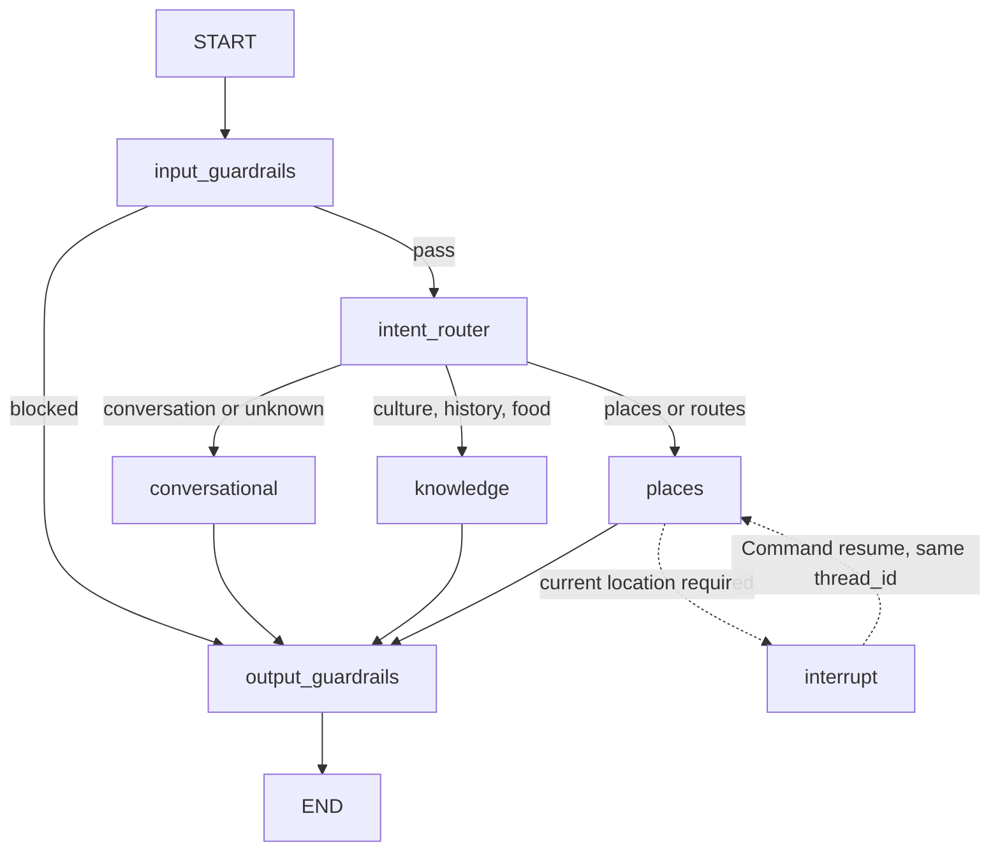

# Agent Orchestration

The application has one agent runtime: `HamNinhGraph`. `POST /chat`,
`GET /chat/stream`, and `POST /chat/resume` all use the same compiled graph and
the same `session_id` as LangGraph `thread_id`.

## Module Layout

- `ham_ninh_graph.py`: graph construction and execution.
- `state.py`: persisted and turn-scoped state contracts.
- `dependencies.py`: injected runtime services.
- `routing_nodes.py`: input guardrails and intent routing.
- `conversation_node.py`: direct and conversational answers.
- `knowledge_node.py`: retrieval, reranking, citations, and grounded answer.
- `places_node.py`: place search, comparison follow-ups, and location interrupt.
- `output_node.py`: final grounding verification.
- `streaming.py`: LangGraph update/custom events to the existing SSE contract.
- `tracing.py`: one Langfuse root trace per user turn.

## State Rules

Each new turn resets response text, citations, places, suggestions, routing,
tool receipts, pending input, and errors. Checkpointed messages and the previous
grounded place candidate set remain available for follow-up questions.

Place comparisons reuse the previous candidate set. A new provider search is
not made for comparative follow-ups.

## Langfuse Tracing

Each `answer`, `stream`, or `resume` execution creates one
`ham-ninh-request` trace. The Langfuse callback is passed through LangGraph's
`RunnableConfig`, so graph nodes and state updates appear as child
observations.

Answer generation, routing, and groundedness checks remain separate child
generations because they are separate model calls. They share the same root
trace for the user turn. The root input contains the initial state; its output
contains the final response and complete final state. The API response exposes
that root ID as `langfuse_trace_id`.

## Failure Rules

There is no secondary agent pipeline. Missing corpus evidence and provider
failures are handled transparently inside the responsible node. Runtime errors
return structured retryable or terminal failure information to the transport.

## Checkpointing

Production uses `AsyncPostgresSaver` when `DATABASE_URL` is configured.
Development and tests use `InMemorySaver`. Location interrupts require a
checkpointer and must resume with `Command(resume=...)` on the same `thread_id`.
