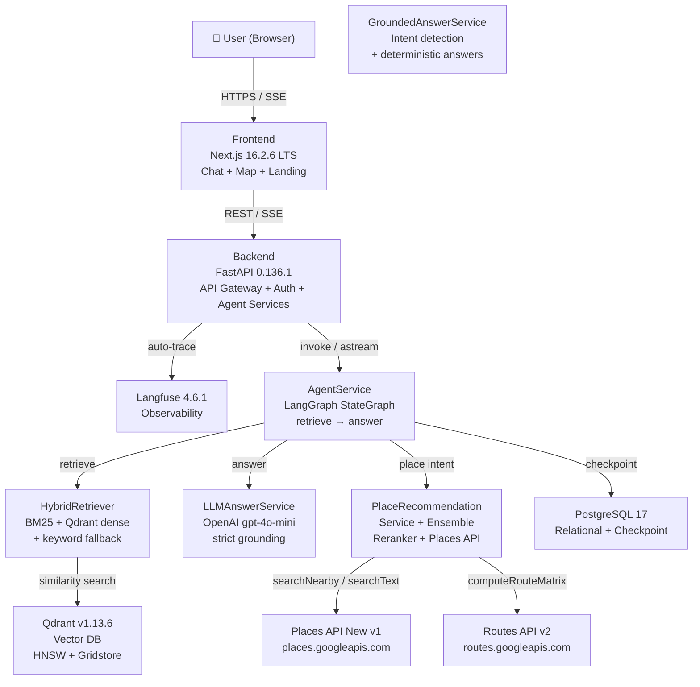
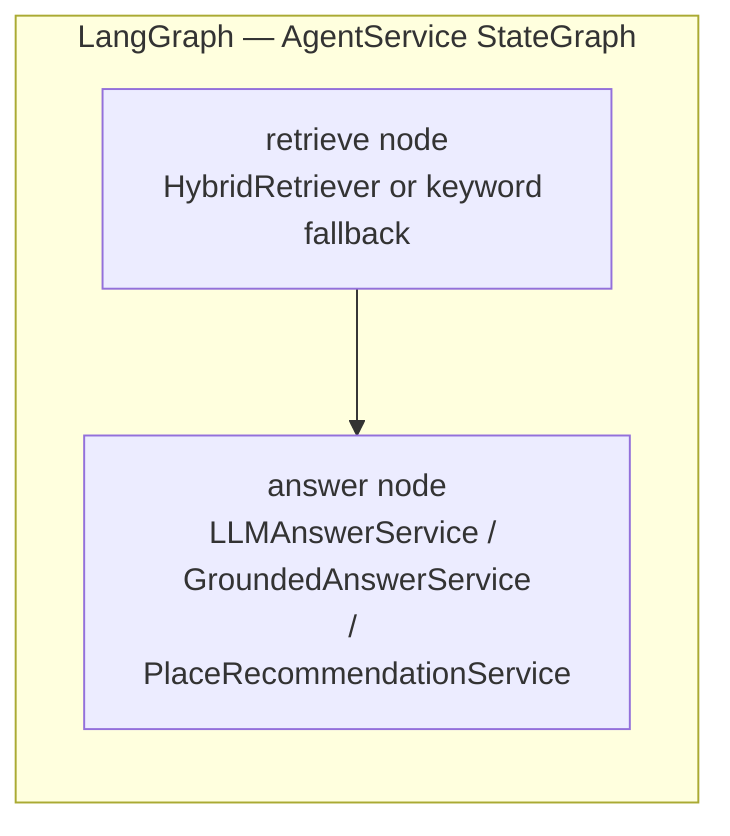
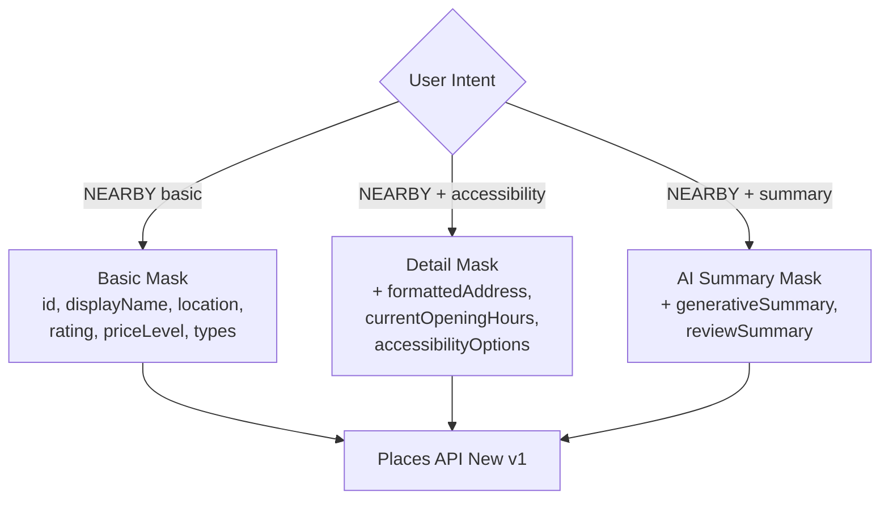
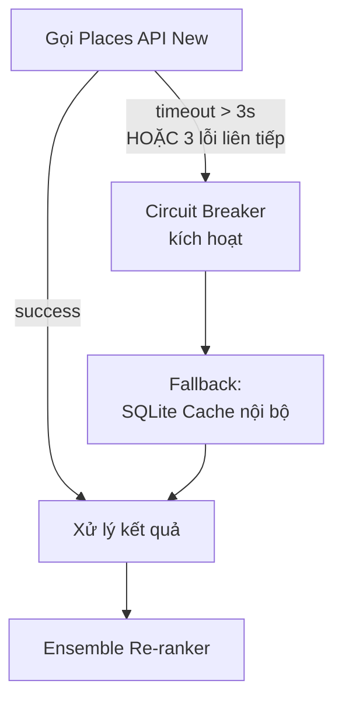
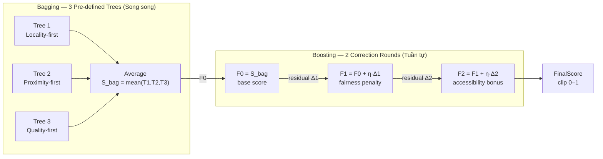
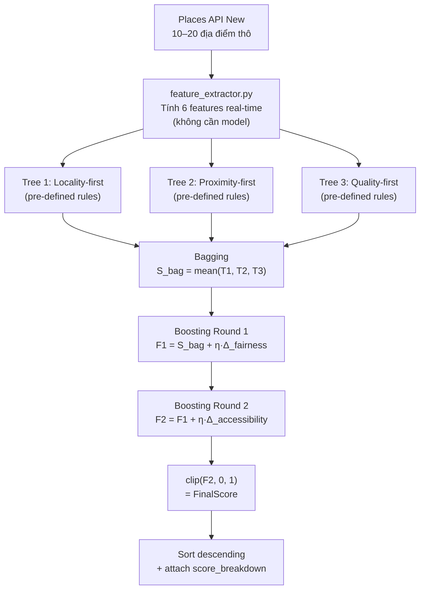
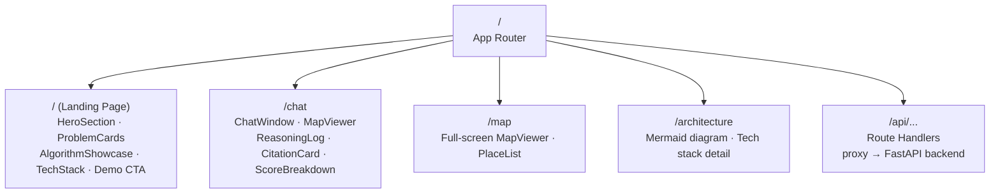
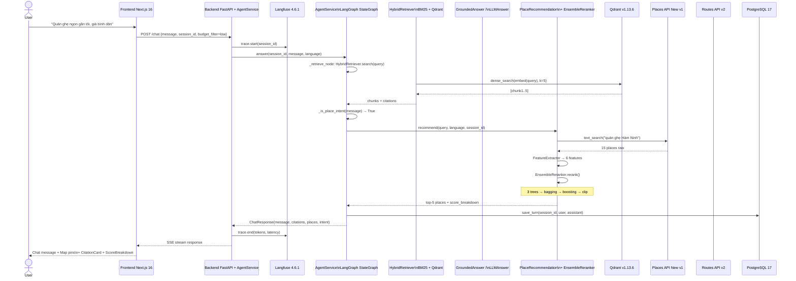

# REQUIREMENTS DOCUMENT
## Ham Ninh Sustainable Tourism AI Assistant

| Trường | Nội dung |
|---|---|
| **Tên dự án** | Ham Ninh Sustainable Tourism AI Assistant |
| **Phiên bản tài liệu** | v3.0.0 |
| **Trạng thái** | In Review |
| **Ngày cập nhật** | 17/05/2026 |
| **Tác giả** | Team |
| **Chủ đề thuật toán** | Trees, Forests, Bagging & Boosting (Ensemble Methods) |
| **Kiến trúc** | Multi-Agent AI · RAG · Responsible AI (5-Axis) |

---

## MỤC LỤC

1. [Versioning & Changelog](#1-versioning--changelog)
2. [Landing Page — Giới thiệu dự án](#2-landing-page--giới-thiệu-dự-án)
3. [Bối cảnh & Mục tiêu](#3-bối-cảnh--mục-tiêu)
4. [Cấu trúc Repository](#4-cấu-trúc-repository)
5. [Tech Stack & Phiên bản chính xác](#5-tech-stack--phiên-bản-chính-xác)
6. [Kiến trúc hệ thống](#6-kiến-trúc-hệ-thống)
7. [Google Places API (New) — Đặc tả tích hợp](#7-google-places-api-new--đặc-tả-tích-hợp)
8. [Ensemble Methods — Ứng dụng ML Core](#8-ensemble-methods--ứng-dụng-ml-core)
9. [5 Trục Responsible AI](#9-5-trục-responsible-ai)
10. [Đặc tả Module Frontend (Next.js 16)](#10-đặc-tả-module-frontend-nextjs-16)
11. [Đặc tả Module Backend (FastAPI + Agent Services)](#11-đặc-tả-module-backend-fastapi--agent-services)
12. [End-to-End Workflow](#12-end-to-end-workflow)
13. [Phụ lục: Glossary](#13-phụ-lục-glossary)

---

## 1. Versioning & Changelog

### 1.1 Versioning Convention

Tài liệu này tuân theo **Semantic Versioning** (`MAJOR.MINOR.PATCH`) áp dụng cho requirements:

| Digit | Khi nào tăng | Ví dụ |
|---|---|---|
| **MAJOR** | Thay đổi phạm vi dự án, thay đổi kiến trúc cốt lõi, thêm/xóa module lớn | `v2.0.0 → v3.0.0` |
| **MINOR** | Thêm section mới, thêm requirement mới, cập nhật tech stack | `v2.0.0 → v2.1.0` |
| **PATCH** | Sửa lỗi mô tả, cập nhật phiên bản package, clarification | `v2.0.0 → v2.0.1` |

**Trạng thái tài liệu:**

| Status | Ý nghĩa |
|---|---|
| `Draft` | Đang soạn thảo, chưa review |
| `In Review` | Đang review nội bộ |
| `Approved` | Đã được team lead approve |
| `Deprecated` | Phiên bản cũ, không còn hiệu lực |

### 1.2 Changelog

---

#### v3.0.0 — 17/05/2026 · `In Review`

**BREAKING CHANGES**

- Thay thế hoàn toàn cách tiếp cận ML (Section 8): từ trained `RandomForestRegressor` + `GradientBoostingRegressor` (yêu cầu labeled data) sang **Pre-defined Rule-based Ensemble** (không cần training, không cần dataset). Toán học Bagging/Boosting giữ nguyên, chỉ thay phần optimization bằng expert-defined rules.

**Added**

- Section 1 (Versioning & Changelog) — tài liệu này.
- Section 1 (cũ → 2): Landing Page rút gọn thành bảng 2-section thay vì 7 subsection chi tiết.
- Số thứ tự toàn bộ sections tăng thêm 1.

**Changed**

- Section 8 (Ensemble Methods): 3 Pre-defined Decision Trees thay sklearn model. 2 Boosting correction stumps thay GBM loop. Feature space rút gọn từ 8 xuống 6 chiều.
- Header metadata: bổ sung trường `Trạng thái` và `Tác giả`.

---

#### v2.0.0 — 15/05/2026 · `Deprecated`

**BREAKING CHANGES**

- Toàn bộ diagram ASCII được thay bằng Mermaid.
- Xóa toàn bộ example code khỏi requirements (chuyển sang ARCHITECTURE.md).

**Added**

- Section Landing Page (Section 1).
- Google Places API (New) được tách thành section riêng (Section 6) với đặc tả Field Mask, Circuit Breaker, endpoint mapping.
- `local_factor` scoring table.
- Score breakdown JSON schema cho Explainability.

**Changed**

- Versions cập nhật chính xác từ PyPI / GitHub Releases: scikit-learn `1.8.0`, Langfuse `4.6.1`, RAGAS `0.4.3`, Qdrant `v1.13.6`, Redis `8.0`.
- Qdrant infra: ghi rõ Gridstore engine thay RocksDB.
- Next.js 16 breaking changes: `proxy.ts`, Cache Components, `agentDevTools`.

---

#### v1.0.0 — 13/05/2026 · `Deprecated`

**Initial release**

- Bản requirements đầu tiên. ASCII diagram, ví dụ code inline, versions chưa được verify.
- Kiến trúc Multi-Agent cơ bản: Supervisor / RAG Agent / Maps Agent.
- 5 trục Responsible AI đầy đủ.
- Tech stack ban đầu: Next.js 15 (chưa đúng), FastAPI, LangGraph, Qdrant, scikit-learn.

---

## 2. Landing Page — Giới thiệu dự án

Route `/` của module `frontend/`. Truyền tải ba thông điệp: AI có trách nhiệm / bảo tồn văn hóa / năng lực kỹ thuật.

### Landing Page Sections

| Section | Nội dung chính |
|---|---|
| **Hero** | Tagline, mô tả ≤ 40 từ, CTA: "Khám phá ngay" → `/chat` · "Xem kiến trúc" → `/architecture` |
| **Problem** | 3 card: Over-tourism / Thiên vị kinh tế nền tảng lớn / Thiếu thông tin di sản |
| **Solution** | 3 trụ cột: RAG Agent · Maps Agent · Ensemble Re-ranker (Fairness Engine) |
| **Responsible AI** | 5 card tương ứng 5 trục: tên trục + 1 dòng mô tả + metric mục tiêu |
| **Algorithm Showcase** | Bar chart minh họa Bagging (3 trees) → Boosting (correction) → FinalScore |
| **Tech Stack** | Logo grid: Next.js 16 / FastAPI / LangGraph / Qdrant / Google Maps / scikit-learn / RAGAS / Langfuse |
| **Demo CTA** | Screenshot walkthrough, nút "Trải nghiệm Demo" → `/chat` |

### Landing Page Non-functional Requirements

| Metric | Target |
|---|---|
| First Contentful Paint | ≤ 1.5s (Cache Components, Next.js 16) |
| i18n | vi (default) + en (`next-intl`) |
| Responsive | 375px / 768px / 1280px |
| Accessibility | WCAG 2.2 AA |

---

## 3. Bối cảnh & Mục tiêu

### 2.1 Bối cảnh

Làng chài **Hàm Ninh** (Phú Quốc, Kiên Giang) là di sản văn hóa với nghề biển lâu đời, nổi tiếng với ghẹ Hàm Ninh và mắm tôm truyền thống. Làn sóng du lịch tạo ra hai vấn đề cấu trúc:

- **Economic displacement:** Nền tảng gợi ý du lịch toàn cầu ưu tiên cơ sở có ngân sách marketing lớn, đẩy tiểu thương địa phương (ngư dân, thợ làm mắm, người cao tuổi) ra ngoài luồng doanh thu.
- **Cultural erosion:** Thiếu nguồn thông tin tin cậy về lịch sử, giai thoại, và ý nghĩa văn hóa của các địa danh Hàm Ninh.

### 2.2 Mục tiêu hệ thống

| ID | Mục tiêu | Phân loại |
|---|---|---|
| OBJ-01 | Cung cấp thông tin văn hóa / lịch sử Hàm Ninh chính xác thông qua RAG | Functional |
| OBJ-02 | Hỗ trợ tìm kiếm địa điểm, tuyến đường thực tế thông qua Places API (New) | Functional |
| OBJ-03 | Ưu tiên cơ sở kinh doanh địa phương qua Ensemble Re-ranking | Fairness |
| OBJ-04 | Tuân thủ 5 trục Responsible AI | Ethical |
| OBJ-05 | Mọi gợi ý đều có reasoning trace, kiểm chứng được | Transparency |

### 2.3 Phạm vi

**Trong phạm vi:** Chatbot hỏi đáp đa ngôn ngữ, gợi ý địa điểm có re-ranking, bản đồ tương tác, citation từ RAG, reasoning log, observability dashboard.

**Ngoài phạm vi:** Hệ thống đặt phòng/thanh toán, CRM, fine-tuning LLM từ đầu, mobile native app.

---

## 4. Cấu trúc Repository

```
ham-ninh-ai/
│
├── docs/
│   ├── REQUIREMENTS.md
│   ├── ARCHITECTURE.md
│   ├── API_SPEC.md
│   ├── ETHICAL_AUDIT.md
│   ├── DATA_DICTIONARY.md
│   └── DEPLOYMENT.md
│
├── frontend/                        # Next.js 16.2.6 LTS
│   ├── src/
│   │   ├── app/                     # App Router
│   │   │   ├── (landing)/           # Route group: Landing Page
│   │   │   ├── (chat)/              # Route group: Chat Interface
│   │   │   ├── (map)/               # Route group: Interactive Map
│   │   │   ├── architecture/        # Kiến trúc hệ thống
│   │   │   └── api/                 # Route Handlers (proxy → backend)
│   │   ├── components/
│   │   │   ├── landing/             # HeroSection, ProblemCard, AlgorithmShowcase
│   │   │   ├── chat/                # ChatWindow, MessageBubble, StreamingText
│   │   │   ├── map/                 # MapViewer (Google Maps JS SDK)
│   │   │   ├── reasoning/           # ReasoningLog, CitationCard, ScoreBreakdown
│   │   │   └── ui/                  # Shared components
│   │   ├── lib/
│   │   │   ├── api-client.ts
│   │   │   ├── sse-stream.ts
│   │   │   └── types.ts
│   │   └── i18n/                    # next-intl locales (vi, en)
│   ├── proxy.ts                     # Next.js 16: network boundary (thay middleware.ts)
│   ├── next.config.ts
│   ├── package.json
│   └── tsconfig.json
│
└── backend/                         # FastAPI 0.136.1 — API Gateway + Agent Orchestration
    ├── app/
    │   ├── main.py                  # Lifespan, router wiring, service init
    │   ├── routers/
    │   │   ├── chat.py              # POST /chat, GET /chat/stream (SSE)
    │   │   ├── health.py            # GET /health, /health/ready
    │   │   ├── admin.py             # eval trigger, trace viewer, ingest
    │   │   └── auth.py              # Login, register, OTP, verify-email
    │   ├── models/
    │   │   ├── request.py           # Pydantic v2 request schemas
    │   │   ├── response.py          # Pydantic v2 response schemas
    │   │   ├── places.py            # PlaceCandidate, PlaceSearchRequest, score types
    │   │   ├── rag.py               # RAGChunk, RetrievalResult
    │   │   └── user.py              # User model
    │   ├── services/
    │   │   ├── agent_service.py     # LangGraph StateGraph (retrieve → answer nodes)
    │   │   ├── hybrid_retriever.py  # BM25 + Qdrant dense + keyword fallback
    │   │   ├── retriever.py         # In-memory keyword search fallback
    │   │   ├── grounded_answer.py   # Intent detection + deterministic answer from chunks
    │   │   ├── llm_answer_service.py # OpenAI LLM answer with strict grounding
    │   │   ├── ensemble_reranker.py # 3-tree Bagging + 2-step Boosting (fairness)
    │   │   ├── feature_extractor.py # Feature engineering (6 features)
    │   │   ├── place_recommendation_service.py # Places → Ensemble → ranked results
    │   │   ├── places_service.py    # Google Places API (New) client
    │   │   ├── routes_service.py    # Google Routes API client
    │   │   ├── qdrant_service.py    # Qdrant vector DB operations
    │   │   ├── embedding_service.py # OpenAI embedding API wrapper
    │   │   ├── corpus_loader.py     # JSONL document ingestion
    │   │   ├── proposition_chunker.py # Proposition extraction for embeddings
    │   │   ├── langfuse_service.py  # Observability traces
    │   │   ├── jwt_service.py       # JWT auth token management
    │   │   ├── email_service.py     # Email delivery (OTP, verification)
    │   │   └── user_service.py      # PostgreSQL-backed user management
    │   ├── middleware/
    │   │   ├── auth.py              # API key verification
    │   │   ├── correlation.py       # X-Request-ID correlation middleware
    │   │   ├── cors.py              # CORS configuration
    │   │   └── rate_limiter.py      # SlowAPI rate limiting
    │   └── core/
    │       ├── config.py            # Pydantic BaseSettings
    │       └── logging.py           # structlog setup
    ├── migrations/                  # Alembic (PostgreSQL 17)
    ├── tests/                       # pytest test suite
    ├── Dockerfile
    └── requirements.txt
```

---

## 5. Tech Stack & Phiên bản chính xác

### 4.1 Frontend

| Package | Phiên bản | Ghi chú |
|---|---|---|
| **Next.js** | `16.2.6 LTS` | Latest stable May 2026. Turbopack default (dev + prod). `proxy.ts` thay `middleware.ts`. Cache Components (PPR stable). Agent DevTools experimental (16.2+) |
| **React** | `19.x` | Bundled với Next.js 16 |
| **TypeScript** | `5.x` | Strict mode bắt buộc |
| **Tailwind CSS** | `4.x` | Utility-first, JIT |
| **Vercel AI SDK** | `4.x` | SSE streaming, `useChat` hook |
| **next-intl** | `3.x` | i18n (vi / en) |
| **Google Maps JS SDK** | `weekly` channel | `@googlemaps/js-api-loader` |

> **Next.js 16 breaking changes cần lưu ý:**
> - `middleware.ts` deprecated → dùng `proxy.ts` ở root để định nghĩa network boundary
> - Cache phải explicit: dùng `use cache` directive hoặc Cache Components
> - `experimental.ppr` flag bị xóa hoàn toàn — dùng Cache Components configuration

### 4.2 Backend + Agent Services

Tất cả agent orchestration và ML code nằm trong `backend/app/services/` — không có module `agents/` riêng biệt.

| Package | Phiên bản | Ghi chú |
|---|---|---|
| **Python** | `3.12` | Khuyến nghị; scikit-learn 1.8.0 hỗ trợ 3.11–3.14 |
| **FastAPI** | `0.136.1` | Latest May 2026. Async-first, SSE native, Pydantic v2 |
| **langgraph** | `1.2.0` | Durable state, per-node timeout. Dùng trong `agent_service.py` (retrieve → answer StateGraph) |
| **langgraph-checkpoint-postgres** | `3.1.0` | PostgreSQL-backed session checkpointing |
| **langchain-core** | `1.4.0` | Base abstractions |
| **langchain-openai** | — | OpenAI LLM + Embedding integration |
| **openai** | `1.82.0` | SDK trực tiếp cho embedding (batch 100/chunk) và LLM (gpt-4o-mini) |
| **qdrant-client** | `1.18.0` | Python SDK tương thích Qdrant server v1.13.x, hỗ trợ AsyncQdrantClient |
| **scikit-learn** | `1.8.0` | Dec 2025. `RandomForestRegressor`, `GradientBoostingRegressor` (dùng trong ensemble reranker) |
| **ragas** | `0.4.3` | Jan 2026. Metrics: Faithfulness, Answer Relevance, Context Recall, Context Precision |
| **nemoguardrails** | `0.17.0` | Input/Output Guardrails |
| **langfuse** | `4.6.1` | May 2026. SDK v4 (full rewrite Mar 2026). Traces, cost, latency |
| **google-maps-places** | `0.8.0` | Jan 2026. Python client cho Places API (New) v1 |
| **Pydantic** | `v2.x` | Schema validation, BaseSettings |
| **Uvicorn** | `0.34+` | ASGI server |
| **asyncpg** | `0.30+` | Async PostgreSQL driver |
| **structlog** | `24.x` | Structured logging |
| **slowapi** | `0.1.x` | Rate limiting middleware |
| **alembic** | `1.14+` | Database migrations |

### 4.3 Infrastructure

| Service | Version / Image | Vai trò |
|---|---|---|
| **Qdrant** | `v1.13.6` (Docker: `qdrant/qdrant:v1.13.6`) | Vector database. Gridstore storage engine (RocksDB deprecated từ v1.17). HNSW index. REST + gRPC |
| **PostgreSQL** | `17` | Relational data + agent session checkpointing (PostgresAgentCheckpointer in agent_service.py) |
| **Redis Open Source** | `8.0` | Tích hợp native Redis Search, JSON, time series. Semantic cache, rate limit, session |
| **Docker Compose** | `v2.x` | Container orchestration local / staging |

### 4.4 Google Maps Platform

| API | Base URL | Vai trò |
|---|---|---|
| **Places API (New)** | `https://places.googleapis.com/v1` | Nearby Search, Text Search, Place Details, Autocomplete, AI Summaries (GA) |
| **Routes API** | `https://routes.googleapis.com/v2` | Route Matrix (distance/duration) |
| **Maps JavaScript API** | `https://maps.googleapis.com/maps/api/js` | Frontend map rendering |

---

## 6. Kiến trúc hệ thống

### 5.1 Sơ đồ tổng thể



> **Lưu ý:** Không có module `agents/` riêng biệt. Toàn bộ agent orchestration (AgentService, HybridRetriever, GroundedAnswerService, LLMAnswerService, PlaceRecommendationService, EnsembleReranker) nằm trong `backend/app/services/`.

### 5.2 Agent Graph Topology (LangGraph StateGraph trong AgentService)



AgentService sử dụng LangGraph StateGraph với 2 node chính:
- **retrieve node**: Gọi HybridRetriever (BM25 + Qdrant) hoặc keyword fallback
- **answer node**: Phát hiện intent → LLMAnswerService (LLM grounding), GroundedAnswerService (deterministic fallback), hoặc PlaceRecommendationService (địa điểm)

---

## 7. Google Places API (New) — Đặc tả tích hợp

### 6.1 Tổng quan

Places API (New) hoạt động trên infrastructure Google Cloud, là thế hệ thay thế cho Places API (Legacy). Base URL: `https://places.googleapis.com/v1`. Hỗ trợ API Key và OAuth 2.0.

Điểm khác biệt quan trọng so với Legacy API:

- **Field Mask bắt buộc** (`X-Goog-FieldMask` header): chỉ trả về fields được chỉ định, tối ưu chi phí billing
- **AI-powered Summaries (GA)**: Place Summary, Review Summary, Area Summary
- **180+ place types** mới cho filtering
- **Search along route (GA)**: tìm địa điểm dọc tuyến đường định sẵn
- **`googleMapsTypeLabel`**: type label bản địa hóa theo ngôn ngữ request

### 6.2 Endpoints sử dụng

**Nearby Search (New)**

- Endpoint: `POST https://places.googleapis.com/v1/places:searchNearby`
- Mục đích: Tìm địa điểm trong bán kính từ tọa độ người dùng
- Field mask yêu cầu: `places.id, places.displayName, places.formattedAddress, places.rating, places.userRatingCount, places.priceLevel, places.types, places.location, places.currentOpeningHours, places.accessibilityOptions, places.googleMapsUri`
- `maxResultCount`: tối đa 20
- `rankPreference`: `POPULARITY` (default) hoặc `DISTANCE`

**Text Search (New)**

- Endpoint: `POST https://places.googleapis.com/v1/places:searchText`
- Mục đích: Tìm địa điểm theo từ khóa văn bản (VD: "quán ghẹ Hàm Ninh")
- Bổ sung field: `places.regularOpeningHours`
- Hỗ trợ: `searchAlongRouteParameters`, `minRating`, `priceLevels` filter

**Place Details (New)**

- Endpoint: `GET https://places.googleapis.com/v1/places/{place_id}`
- Mục đích: Thông tin chi tiết sau khi có `place_id`
- Field bổ sung: `editorialSummary, reviews, photos, paymentOptions`
- AI Summaries: `generativeSummary, reviewSummary, areaSummary` (GA)

**Autocomplete (New)**

- Endpoint: `POST https://places.googleapis.com/v1/places:autocomplete`
- Mục đích: Gợi ý địa điểm khi người dùng gõ trên Frontend
- Hỗ trợ: `includedPrimaryTypes` filter

### 6.3 Field Mask Strategy



### 6.4 Mapping Fields → Ensemble Re-ranker Features

| Trường Places API (New) | Feature | Transformation |
|---|---|---|
| `rating` | `rating` | float [1.0, 5.0], direct |
| `userRatingCount` | `review_count_log` | `log(count + 1)` |
| `priceLevel` (enum) | `price_level` | FREE=0 → VERY_EXPENSIVE=4 |
| `currentOpeningHours.openNow` | `is_open_now` | bool → int |
| `location` (lat/lng) | `distance_meters` | Haversine từ user coordinates |
| `accessibilityOptions.wheelchairAccessibleEntrance` | `accessibility_score` (partial) | bool → float |
| `types` | `category_match` | cosine sim(embed(query), embed(types)) |
| *(internal metadata DB)* | `local_factor` | Không từ API |

### 6.5 Circuit Breaker — Fallback



---

## 8. Ensemble Methods — Ứng dụng ML Core

### 7.1 Bài toán Re-ranking

**Vấn đề:** Places API (New) mặc định xếp hạng theo `POPULARITY` — phản ánh lượng review và engagement, có lợi cho chuỗi lớn có ngân sách marketing, bất lợi cho tiểu thương địa phương.

**Giải pháp:** Áp dụng toán học Bagging và Boosting thông qua **Pre-defined Rule-based Ensemble** — thay vì train model từ labeled dataset (phức tạp, cần nhiều dữ liệu), các Decision Tree được định nghĩa thủ công bởi domain knowledge. Cấu trúc toán học hoàn toàn giữ nguyên; chỉ thay phần "tối ưu hóa trọng số từ data" bằng "chuyên gia xác định trọng số dựa trên đặc thù bài toán".

> **Lý do hợp lệ về mặt học thuật:** Expert-defined Decision Trees là một phương pháp Knowledge Engineering được công nhận, đặc biệt phù hợp khi labeled data khan hiếm. Toán học Bagging (trung bình độc lập) và Boosting (hiệu chỉnh tuần tự) vẫn được áp dụng đúng quy trình.

### 7.2 Feature Space (6 chiều — rút gọn để khả thi)

| Feature | Type | Nguồn | Tính toán |
|---|---|---|---|
| `rating` | float [1.0–5.0] | Places API (New) | Direct |
| `distance_meters` | float | Haversine(user, place) | Tính từ lat/lng |
| `price_level` | int [0–4] | Places API (New) | Direct |
| `is_open_now` | int {0, 1} | Places API (New) | bool → int |
| `local_factor` | float [0.0–1.0] | Internal metadata (admin nhập) | Xem 7.3 |
| `category_match` | float [0.0–1.0] | Cosine sim(query ↔ types) | Tính từ embedding có sẵn |

> Không cần training data, không cần model serialization. Tất cả tính được real-time từ Places API response và metadata đã có.

### 7.3 `local_factor` — Nhân tố công bằng địa phương

Admin nhập metadata một lần cho từng địa điểm, lưu PostgreSQL:

| Tiêu chí | Điểm |
|---|---|
| Đăng ký hộ kinh doanh cá thể địa phương | +0.40 |
| Chủ sở hữu là hộ gia đình ngư dân | +0.25 |
| Chứng nhận nghề truyền thống địa phương | +0.20 |
| Sử dụng lao động người cao tuổi / người khuyết tật | +0.15 |

$$\text{local\_factor} = \min\!\left(\sum \text{điểm tiêu chí}, \ 1.0\right)$$

### 7.4 Pre-defined Decision Trees (thay thế trained model)

Thay vì train, hệ thống định nghĩa **3 Decision Tree thủ công**, mỗi cây phản ánh một góc nhìn đánh giá khác nhau, có căn cứ từ đặc thù du lịch địa phương:

**Tree 1 — Locality-first (Ưu tiên địa phương)**

```
IF local_factor > 0.6 AND is_open_now = 1:
    score = 0.9
ELSE IF local_factor > 0.6:
    score = 0.7
ELSE IF local_factor > 0.3:
    score = 0.5
ELSE:
    score = 0.2
```

**Tree 2 — Proximity-first (Ưu tiên khoảng cách)**

```
IF distance_meters < 300:
    score = 0.9
ELSE IF distance_meters < 800:
    score = 0.65 + (rating - 3.0) * 0.1
ELSE IF distance_meters < 2000:
    score = 0.4 + local_factor * 0.2
ELSE:
    score = 0.15
```

**Tree 3 — Quality-first (Ưu tiên chất lượng + budget)**

```
IF rating >= 4.5 AND price_level <= 2:
    score = 0.85 + local_factor * 0.15
ELSE IF rating >= 4.0 AND price_level <= 1:
    score = 0.75
ELSE IF rating >= 3.5:
    score = 0.5 + (2 - price_level) * 0.05
ELSE:
    score = 0.2
```

> Các ngưỡng (`300m`, `4.5 sao`, `price_level ≤ 2`…) được xác định từ khảo sát thực tế đặc thù làng chài Hàm Ninh, không cần optimization.

### 7.5 Toán học Bagging — Áp dụng với 3 Pre-defined Trees

**Nguyên lý Bagging:** Ensemble từ $B$ model độc lập, kết quả cuối là trung bình (giảm variance):

$$\hat{f}_{\text{Bag}}(\mathbf{x}) = \frac{1}{B} \sum_{b=1}^{B} T_b(\mathbf{x})$$

**Ứng dụng cụ thể** ($B = 3$ pre-defined trees):

$$S_{\text{bag}} = \frac{T_1(\mathbf{x}) + T_2(\mathbf{x}) + T_3(\mathbf{x})}{3}$$

Mỗi Tree nhìn bài toán từ một góc độ khác nhau (locality, proximity, quality) → Trung bình hóa đảm bảo không có tiêu chí nào thống trị hoàn toàn, giảm variance của scoring.

### 7.6 Toán học Boosting — Hiệu chỉnh tuần tự theo Residual

**Nguyên lý Boosting:** Mỗi vòng lặp $m$ thêm một correction term $\Delta_m$ để giảm sai lệch còn lại (residual) của model trước:

$$F_m(\mathbf{x}) = F_{m-1}(\mathbf{x}) + \eta \cdot \Delta_m(\mathbf{x})$$

**Ứng dụng cụ thể** (2 vòng hiệu chỉnh, $\eta = 0.3$):

**Vòng 0 — Base model:**

$$F_0(\mathbf{x}) = S_{\text{bag}}$$

**Vòng 1 — Correction: Fairness penalty cho chain business:**

$$\Delta_1(\mathbf{x}) = \begin{cases} -0.15 & \text{nếu } \text{local\_factor} < 0.1 \text{ (chuỗi lớn)} \\ 0 & \text{otherwise} \end{cases}$$

$$F_1(\mathbf{x}) = F_0(\mathbf{x}) + 0.3 \times \Delta_1(\mathbf{x})$$

**Vòng 2 — Correction: Accessibility bonus:**

$$\Delta_2(\mathbf{x}) = \begin{cases} +0.10 & \text{nếu địa điểm có } \texttt{wheelchairAccessibleEntrance} = \text{true} \\ 0 & \text{otherwise} \end{cases}$$

$$F_2(\mathbf{x}) = F_1(\mathbf{x}) + 0.3 \times \Delta_2(\mathbf{x})$$

**Kết quả:**

$$\text{FinalScore} = \text{clip}\!\left(F_2(\mathbf{x}),\ 0.0,\ 1.0\right)$$

> Mỗi correction term $\Delta_m$ là một **stump** (Decision Tree depth=1) — chuẩn xác với định nghĩa Boosting trong lý thuyết. Không cần optimization loop, chỉ cần áp công thức.

### 7.7 So sánh Bagging vs Boosting trong hệ thống



| Tiêu chí | Bagging (3 Trees) | Boosting (2 Corrections) |
|---|---|---|
| Thực thi | Song song | Tuần tự |
| Mục tiêu | Giảm variance (cân bằng 3 góc nhìn) | Giảm bias (hiệu chỉnh fairness cụ thể) |
| Cần training data | Không | Không |
| Cần training loop | Không | Không |
| Cần serialize model | Không | Không |
| Giải thích được | Hoàn toàn | Hoàn toàn |

### 7.8 Score Breakdown — Explainability

Mỗi địa điểm trả về `score_breakdown` JSON để render `<ScoreBreakdown>` component trên Frontend:

```
{
  "tree1_locality":   0.90,
  "tree2_proximity":  0.65,
  "tree3_quality":    0.75,
  "s_bag":            0.77,
  "delta1_fairness":  -0.045,
  "delta2_access":    0.0,
  "final_score":      0.72,
  "rank":             1
}
```

Người dùng thấy đúng lý do tại sao địa điểm được xếp hạng: bao nhiêu phần trăm do locality, proximity, quality, và correction fairness.

### 7.9 Pipeline Re-ranking



---

## 9. 5 Trục Responsible AI

### 8.1 Trục 1 — Reliability (Tính tin cậy)

**Mục tiêu:** Nhất quán, giảm hallucination, kết quả kiểm chứng được.

| ID | Yêu cầu | Tiêu chí chấp nhận |
|---|---|---|
| REL-01 | **Strict Grounding**: chỉ trả lời dựa trên documents từ Qdrant, không dùng parametric knowledge của LLM (GroundedAnswerService + LLMAnswerService) | RAGAS Faithfulness ≥ 0.85 |
| REL-02 | **RAGAS 0.4.3** tích hợp CI/CD, auto-evaluate sau mỗi cập nhật Qdrant collection | Answer Relevance ≥ 0.80; Context Recall ≥ 0.75 |
| REL-03 | **Semantic Cache** (Redis 8.0): query có cosine similarity ≥ 0.95 với cached query → trả cache | Cache hit rate ≥ 30% peak traffic |
| REL-04 | Mọi phản hồi văn hóa/lịch sử kèm **Citation** (tên tài liệu + chunk index) | 100% RAG responses có citation |

### 8.2 Trục 2 — Bias & Fairness (Xử lý thiên vị)

**Mục tiêu:** Công bằng kinh tế, ngôn ngữ, vùng miền.

| ID | Yêu cầu | Tiêu chí chấp nhận |
|---|---|---|
| BIAS-01 | **Economic fairness:** Ensemble Re-ranker đảm bảo ≥ 40% kết quả top-5 là cơ sở địa phương (`local_factor > 0.5`) | Local business top-5 ≥ 40% |
| BIAS-02 | **Language fairness:** Nhận diện tiếng Việt có dấu, không dấu, phương ngữ Nam Bộ | Intent accuracy ≥ 90% trên test set phương ngữ |
| BIAS-03 | **Source diversity:** Qdrant collection từ ≥ 3 nguồn khác nhau (báo chí, dân gian, học thuật) | Diversity score ≥ 3 sources per topic |
| BIAS-04 | **Monthly fairness audit:** Script so sánh tỷ lệ local vs chain business trong log kết quả | Audit log Langfuse, review mỗi 30 ngày |

### 8.3 Trục 3 — Robustness (Khả năng chịu lỗi)

**Mục tiêu:** Chịu tấn công, lỗi hạ tầng, dữ liệu nhiễu.

| ID | Yêu cầu | Tiêu chí chấp nhận |
|---|---|---|
| ROB-01 | **Input filtering:** Phát hiện và chặn Prompt Injection (keyword-based detection trong GroundedAnswerService) | Block rate ≥ 99% trên injection test suite |
| ROB-02 | **Topic Filter:** Từ chối query ngoài phạm vi du lịch / văn hóa Hàm Ninh | Precision ≥ 0.95 trên off-topic test set |
| ROB-03 | **Output Grounding Check:** Place recommendation không trả địa điểm ngoài Places API response | 0% hallucinated locations |
| ROB-04 | **Circuit Breaker:** Places API timeout > 3s hoặc 3 lỗi liên tiếp → fallback SQLite | Activation 100% đúng điều kiện |
| ROB-05 | **Durable State (PostgresAgentCheckpointer):** Agent session checkpoint qua PostgreSQL 17, phục hồi sau server restart | Recovery test pass 100% |
| ROB-06 | **Graceful degradation:** Qdrant unavailable → keyword fallback; OpenAI unavailable → GroundedAnswerService deterministic answers | Fallback 100% đúng điều kiện |

### 8.4 Trục 4 — Social Impact (Tác động xã hội)

**Mục tiêu:** Bảo vệ sinh kế và quyền tiếp cận của nhóm yếu thế.

| ID | Nhóm | Yêu cầu | Tiêu chí chấp nhận |
|---|---|---|---|
| SOC-01 | Tiểu thương / ngư dân | `local_factor` metadata gắn nhãn cho ≥ 80% cơ sở địa phương đã đăng ký | Coverage ≥ 80% |
| SOC-02 | Người cao tuổi / người khuyết tật | Accessibility warning khi `accessibilityOptions.wheelchairAccessibleEntrance = false` và địa điểm yêu cầu di chuyển khó | Warning 100% khi điều kiện đúng |
| SOC-03 | Ngân sách thấp | `price_level` filter hoạt động; ưu tiên `PRICE_LEVEL_INEXPENSIVE` khi user chọn budget thấp | Filter chính xác 100% |
| SOC-04 | Người không quen công nghệ | Voice input (Web Speech API); response đơn giản ≤ 100 từ | Voice hoạt động Chrome/Safari |
| SOC-05 | Cộng đồng văn hóa | GroundedAnswerService cung cấp cultural context từ RAG trước khi gợi ý dịch vụ thương mại | 100% HYBRID responses có cultural context |

### 8.5 Trục 5 — Explainability (Tính minh bạch)

**Mục tiêu:** AI không là hộp đen; người dùng kiểm chứng và hiểu được gợi ý.

| ID | Yêu cầu | Triển khai |
|---|---|---|
| EXP-01 | **Reasoning Log UI:** Accordion "Tại sao gợi ý này?" hiển thị `reasoning_log` từ `AgentState` | `<ReasoningLog>` component |
| EXP-02 | **Citation bắt buộc:** Format `[Nguồn: <tên tài liệu>, chunk <N>]` dưới mỗi thông tin văn hóa | `<CitationCard>` component |
| EXP-03 | **Re-ranking explanation:** Bar chart đóng góp từng tree vào FinalScore (tree1_locality, tree2_proximity, tree3_quality, delta1_fairness, delta2_access) | `<ScoreBreakdown>` component |
| EXP-04 | **Langfuse 4.6.1 traces:** Toàn bộ reasoning trace, tool calls, latency, cost per session | 100% requests có trace |
| EXP-05 | **Score breakdown JSON:** Mỗi địa điểm kèm `{tree1_locality, tree2_proximity, tree3_quality, s_bag, delta1_fairness, delta2_access, final_score, rank}` | Accessible via API response + hover UI |

---

## 10. Đặc tả Module Frontend (Next.js 16)

### 10.1 Route Structure (App Router)



### 10.2 Core Components

| Component | Trang | Mô tả |
|---|---|---|
| `HeroSection` | `/` | Tagline, CTA buttons, hero illustration |
| `AlgorithmShowcase` | `/` | Bar chart Ensemble Re-ranking |
| `ResponsibleAIGrid` | `/` | 5 cards / 5 trục Responsible AI |
| `ChatWindow` | `/chat` | SSE streaming, typing indicator, message history |
| `MapViewer` | `/chat`, `/map` | Google Maps JS SDK, auto-pin gợi ý |
| `CitationCard` | `/chat` | Nguồn RAG, expandable |
| `ReasoningLog` | `/chat` | Accordion: `reasoning_log` từ AgentState |
| `ScoreBreakdown` | `/chat`, `/map` | Hover card: rf, gbm, local_factor, final |
| `AccessibilityBadge` | `/chat`, `/map` | Warning khi `accessibility_score < 0.4` |
| `PriceFilter` | `/chat` | Dropdown: Free / Inexpensive / Moderate / Expensive |

### 10.3 Next.js 16 Specific

**`proxy.ts`** (root level): định nghĩa network boundary, proxy `/api/chat` → `backend:8000/chat`.

**Cache strategy:**
- `HeroSection`, `AlgorithmShowcase`, `ResponsibleAIGrid` → `use cache` directive (statically cached)
- `ChatWindow`, `MapViewer` → dynamic, không cache

**Turbopack:** default bundler, không cần `--turbo` flag, 2–5× faster builds so với Webpack.

**`agentDevTools`** (experimental 16.2+): AI agents đọc React DevTools và Next.js diagnostics trong dev mode — hữu ích khi debug SSE streaming.

### 10.4 i18n

| Locale | File |
|---|---|
| `vi` (default) | `src/i18n/vi.json` |
| `en` | `src/i18n/en.json` |

Dùng `next-intl 3.x` với App Router integration.

### 10.5 Non-functional Requirements

| Metric | Target |
|---|---|
| Landing Page FCP | ≤ 1.5s |
| Chat response First Token | ≤ 2s |
| Map tile load | ≤ 1s |
| WCAG Compliance | 2.2 AA |
| Mobile viewport | 375px+ |
| Browser support | Chrome 120+, Safari 17+, Firefox 120+ |

---

## 11. Đặc tả Module Backend (FastAPI + Agent Services)

> **Note:** Không có module `agents/` riêng biệt. Toàn bộ agent orchestration nằm trong `backend/app/services/`.

### 11.1 Agent Services — Overview

Tất cả agent logic được triển khai trong `backend/app/services/`, orchestrated qua FastAPI lifespan trong `main.py`:

| Service | File | Vai trò |
|---|---|---|
| **AgentService** | `agent_service.py` | LangGraph StateGraph (retrieve → answer). Entry point cho chat non-streaming và SSE |
| **HybridRetriever** | `hybrid_retriever.py` | BM25 sparse + Qdrant dense search với keyword fallback |
| **BM25Vectorizer** | `hybrid_retriever.py` | In-process BM25 fit at startup, encode query/chunks thành SparseVector |
| **Retriever** | `retriever.py` | In-memory keyword search fallback khi Qdrant unavailable |
| **GroundedAnswerService** | `grounded_answer.py` | Intent detection + deterministic Vietnamese/English answer từ retrieved chunks |
| **LLMAnswerService** | `llm_answer_service.py` | OpenAI gpt-4o-mini answer với strict grounding prompt |
| **EnsembleReranker** | `ensemble_reranker.py` | 3 decision trees + bagging + boosting fairness scoring |
| **FeatureExtractor** | `feature_extractor.py` | Transform Places API response → 6 features cho reranker |
| **PlaceRecommendationService** | `place_recommendation_service.py` | Orchestrate: Places API → FeatureExtractor → EnsembleReranker → ranked results |
| **GooglePlacesService** | `places_service.py` | Google Places API (New) v1 Python client |
| **GoogleRoutesService** | `routes_service.py` | Google Routes API v2 Python client |
| **QdrantService** | `qdrant_service.py` | Qdrant vector DB operations (upsert, dense/hybrid search) |
| **EmbeddingService** | `embedding_service.py` | OpenAI embedding API wrapper |
| **LangfuseService** | `langfuse_service.py` | Observability traces |

### 11.2 Agent Graph — LangGraph StateGraph

AgentService xây dựng LangGraph StateGraph với 2 node chính:

```
retrieve → answer → END
```

**AgentState (TypedDict):**

| Field | Type | Mô tả |
|---|---|---|
| `session_id` | `str` | LangGraph checkpoint identifier |
| `message` | `str` | User query |
| `language` | `str` | Output language (vi/en) |
| `history` | `list[dict]` | Recent conversation turns (8 turns max) |
| `retrieval_query` | `str` | Query cho retrieval (prior user + current message) |
| `chunks` | `list[RAGChunk]` | Retrieved context chunks |
| `citations` | `list[Citation]` | Citations từ retrieved chunks |
| `response` | `ChatResponse` | Final chat response |
| `fallback_reason` | `str \| None` | Lý do fallback nếu có |
| `intent` | `str \| None` | Detected intent |

**Retrieve node:** Gọi HybridRetriever (BM25 + Qdrant) hoặc keyword fallback. Log retrieval mode (hybrid/keyword/none/error).

**Answer node:** Kiểm tra intent →
- Place intent: gọi `PlaceRecommendationService.recommend()`
- LLM available: gọi `LLMAnswerService.answer()` hoặc `answer_stream()`
- Fallback: gọi `GroundedAnswerService.answer_from_chunks()`

### 11.3 Intent Classification

Intent detection thực hiện trong `grounded_answer.py` qua keyword matching:

| Intent | Keywords (VI/EN) | Action |
|---|---|---|
| `restaurant_search` | nhà hàng, ăn, quán, hải sản, food, restaurant, eat | → PlaceRecommendationService |
| `navigation` | đường đi, chỉ đường, bản đồ, route, navigate | → PlaceRecommendationService |
| `cultural_query` | (RAG chunks available) | → LLMAnswerService / GroundedAnswerService |
| `unknown` | Không khớp | → LLMAnswerService / GroundedAnswerService |

Ngoài ra, `_is_place_intent()` trong AgentService phát hiện place intent qua các từ: "recommend", "gợi ý", "đề xuất", "địa điểm" kết hợp với "hàm ninh".

### 11.4 Checkpointer

AgentService sử dụng `create_agent_checkpointer()` để tạo checkpoint backend:
- **PostgresAgentCheckpointer**: asyncpg-backed, lưu vào bảng `agent_session_messages` (8 turns gần nhất)
- **InMemoryAgentCheckpointer**: Fallback khi DATABASE_URL không khả dụng

### 11.5 API Endpoints

| Method | Endpoint | Mô tả | Auth |
|---|---|---|---|
| `POST` | `/chat` | Gửi message, nhận response đầy đủ | API Key |
| `GET` | `/chat/stream` | SSE streaming response | API Key |
| `POST` | `/auth/register` | Đăng ký tài khoản | None |
| `POST` | `/auth/login` | Đăng nhập | None |
| `POST` | `/auth/verify-email` | Xác thực email | None |
| `POST` | `/auth/resend-otp` | Gửi lại OTP | None |
| `GET` | `/auth/me` | Thông tin user hiện tại | JWT |
| `GET` | `/health` | Liveness check | None |
| `GET` | `/health/ready` | Readiness: Qdrant + PostgreSQL | None |
| `POST` | `/admin/eval/trigger` | Kích hoạt RAGAS evaluation pipeline | Admin JWT |
| `GET` | `/admin/traces` | Langfuse traces summary | Admin JWT |
| `POST` | `/admin/ingest` | Ingest documents vào Qdrant | Admin JWT |

### 11.6 Request Schema (Pydantic v2)

**ChatRequest:**

| Field | Type | Mô tả |
|---|---|---|
| `session_id` | `str` (UUID) | LangGraph checkpoint identifier |
| `message` | `str` (1–2000 chars) | User query |
| `language` | `Literal["vi","en"]` | Output language, default "vi" |
| `budget_filter` | `Literal["free","low","medium","high","any"]` | Places price filter, default "any" |
| `user_location` | `LatLng \| None` | Tọa độ người dùng (opt-in) |
| `accessibility_required` | `bool` | Ưu tiên địa điểm accessible |

### 11.7 Response Schema (Pydantic v2)

**ChatResponse:**

| Field | Type | Mô tả |
|---|---|---|
| `session_id` | `str` | Echo session_id |
| `message` | `str` | Main response text |
| `citations` | `list[Citation]` | Nguồn RAG kèm chunk index |
| `places` | `list[PlaceResult]` | Địa điểm sau re-ranking |
| `reasoning_log` | `list[str]` | Chuỗi suy luận Supervisor |
| `intent` | `str` | Intent được phân loại |
| `langfuse_trace_id` | `str \| None` | Trace ID |
| `latency_ms` | `int` | End-to-end latency |

**PlaceResult:**

| Field | Type | Mô tả |
|---|---|---|
| `place_id` | `str` | Google Place ID |
| `display_name` | `str` | Tên địa điểm |
| `formatted_address` | `str` | Địa chỉ |
| `rating` | `float \| None` | Rating |
| `price_level` | `int \| None` | 0–4 |
| `local_factor` | `float` | [0–1] |
| `final_score` | `float` | Ensemble score |
| `score_breakdown` | `dict` | `{tree1_locality, tree2_proximity, tree3_quality, s_bag, delta1_fairness, delta2_access, final_score, rank}` |
| `accessibility_score` | `float` | [0–1] |
| `accessibility_warning` | `str \| None` | Cảnh báo địa hình |
| `google_maps_uri` | `str` | Google Maps deep link |

### 11.8 Observability (Langfuse 4.6.1)

> SDK v4 là rewrite hoàn toàn (Mar 2026). Migration guide bắt buộc khi upgrade từ v3.x.

| Metric | Mô tả |
|---|---|
| Request latency P50/P95/P99 | End-to-end và per-node |
| LLM token usage + cost | Prompt + completion + estimated cost |
| RAGAS Faithfulness per request | Từ evaluation pipeline |
| `local_factor` distribution top-5 | Tỷ lệ local vs chain theo thời gian |
| Cache hit rate | Redis 8.0 semantic cache |
| Circuit breaker activation count | Places API failure events |

### 11.9 Infrastructure Docker Compose

| Service | Image | Port |
|---|---|---|
| `backend` | Custom Dockerfile | `8000` |
| `qdrant` | `qdrant/qdrant:v1.13.6` | `6333` (REST), `6334` (gRPC) |
| `postgres` | `postgres:17` | `5432` |
| `redis` | `redis:8.0` | `6379` |

---

## 12. End-to-End Workflow



---

## 13. Phụ lục: Glossary

| Thuật ngữ | Giải thích |
|---|---|
| **RAG** (Retrieval-Augmented Generation) | Kiến trúc kết hợp truy xuất tài liệu và sinh ngôn ngữ |
| **Multi-Agent System** | Hệ thống gồm nhiều AI agent chuyên biệt phối hợp |
| **Supervisor Pattern** | Kiến trúc agent Supervisor điều phối Worker agents |
| **Vector Database** | Cơ sở dữ liệu lưu embedding vectors, hỗ trợ similarity search |
| **Embedding** | Biểu diễn văn bản dưới dạng dense vector phản ánh ngữ nghĩa |
| **Cosine Similarity** | Độ đo tương đồng vector, range [-1, 1] |
| **Intent Detection** | Keyword-based intent classification trong GroundedAnswerService (restaurant_search, navigation, cultural_query, unknown) |
| **Guardrails** | Hàng rào kiểm soát Input/Output của LLM |
| **Prompt Injection** | Tấn công chèn lệnh độc hại vào input LLM |
| **Circuit Breaker** | Pattern tự động ngắt kết nối khi service lỗi, chuyển fallback |
| **Strict Grounding** | Ràng buộc LLM chỉ dùng context được cung cấp |
| **Re-ranking** | Sắp xếp lại thứ hạng kết quả theo tiêu chí tùy chỉnh |
| **Pre-defined Decision Tree** | Decision Tree được định nghĩa thủ công bởi domain knowledge, không cần training data |
| **Bagging** | Bootstrap Aggregation — trung bình 3 pre-defined tree scores để giảm variance |
| **Boosting** | Ensemble tuần tự, 2 correction rounds (fairness penalty + accessibility bonus) với learning rate η=0.3 |
| **Feature Engineering** | Tạo và lựa chọn features phù hợp cho ML model |
| **local_factor** | Nhân tố tùy chỉnh đo mức độ bản địa của cơ sở kinh doanh |
| **Durable State** | Trạng thái agent lưu persistent, phục hồi sau sự cố |
| **Observability** | Khả năng quan sát hành vi hệ thống qua metrics, logs, traces |
| **SSE** (Server-Sent Events) | Giao thức streaming một chiều server → client |
| **RAGAS** | Framework đánh giá RAG pipeline (Faithfulness, Answer Relevance…) |
| **Langfuse** | Nền tảng observability chuyên biệt cho LLM applications |
| **Faithfulness** | RAGAS metric: response trung thực với retrieved context |
| **Field Mask** | Places API (New): chỉ định fields cần trả về, giảm cost |
| **HNSW** | Hierarchical Navigable Small World — thuật toán index vector |
| **BM25** | Best Matching 25 — thuật toán sparse ranking cho hybrid retrieval |
| **AgentService** | LangGraph StateGraph orchestration trong `backend/app/services/` (retrieve → answer nodes) |
| **HybridRetriever** | Dense (Qdrant embedding) + sparse (BM25) search với keyword fallback |
| **GroundedAnswerService** | Intent detection + deterministic answer composition từ retrieved chunks |
| **EnsembleReranker** | 3 pre-defined decision trees + bagging + boosting fairness scoring |
| **Places API (New)** | Thế hệ mới Google Places API, base URL `places.googleapis.com/v1` |
| **PostgresAgentCheckpointer** | Custom asyncpg-backed session checkpointer trong `agent_service.py` (bảng `agent_session_messages`, 8 turns gần nhất) |
| **Cache Components** | Next.js 16: explicit cache control thay implicit caching |
| **proxy.ts** | Next.js 16: network boundary file thay `middleware.ts` |
| **Gridstore** | Qdrant v1.13+: storage engine thay thế RocksDB |
| **DeltaChannel** | LangGraph 1.1+: channel type lưu incremental delta thay full state |

---

*Tài liệu soạn theo chuẩn Software Requirements Specification. Mọi thay đổi phải được version và peer-review trước khi áp dụng.*
