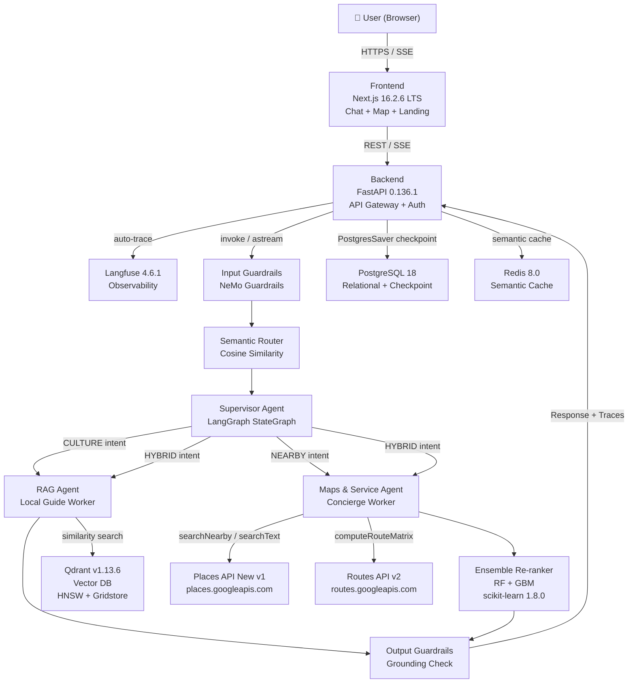
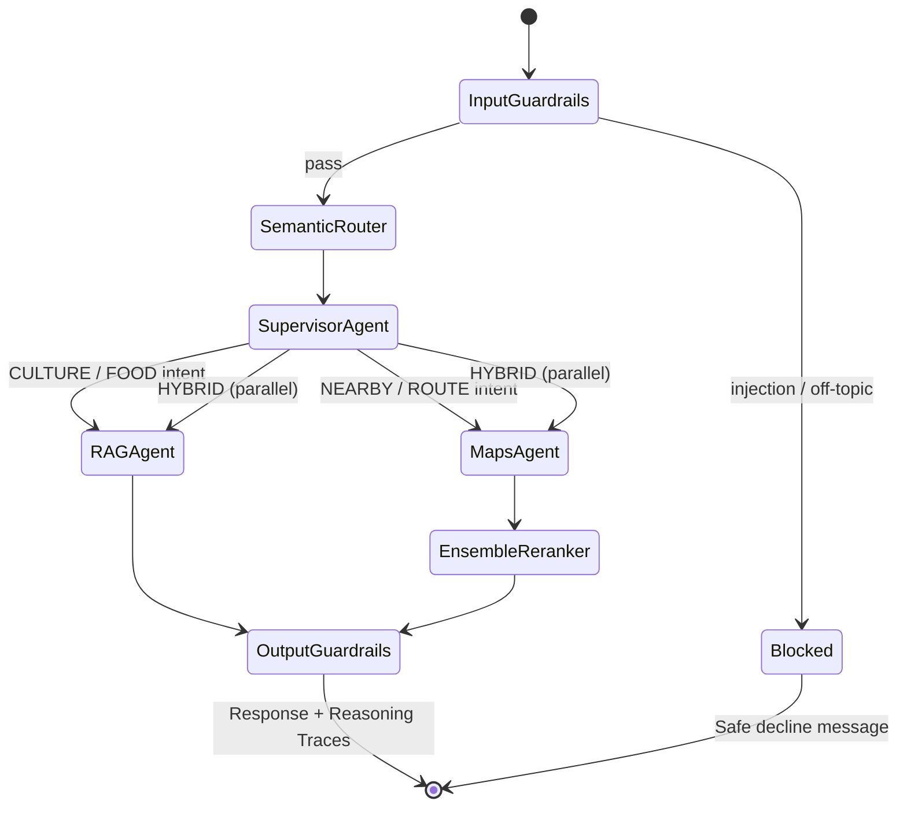
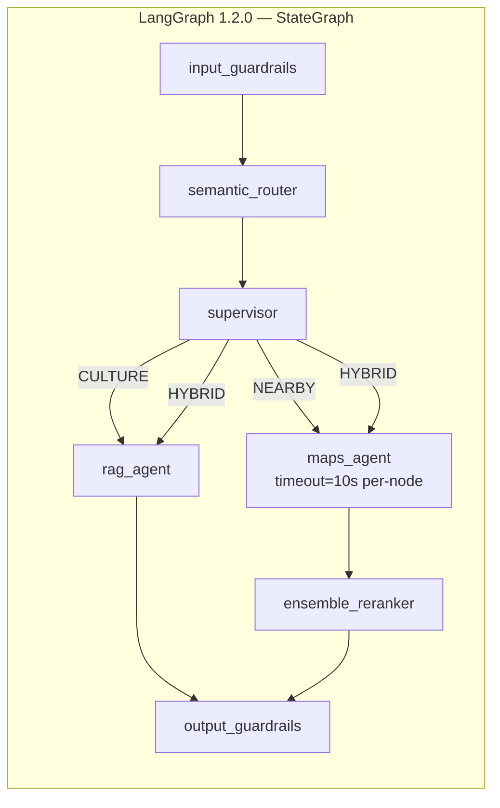
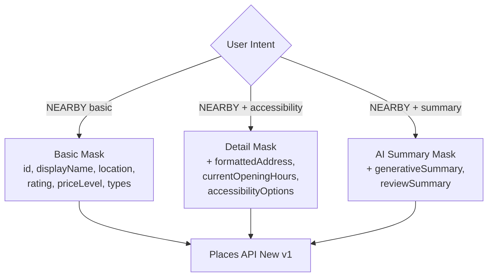
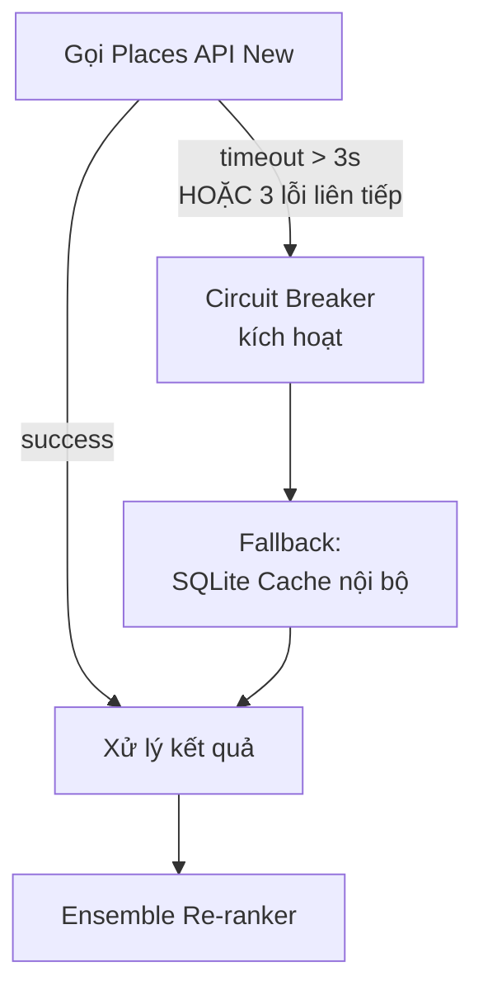
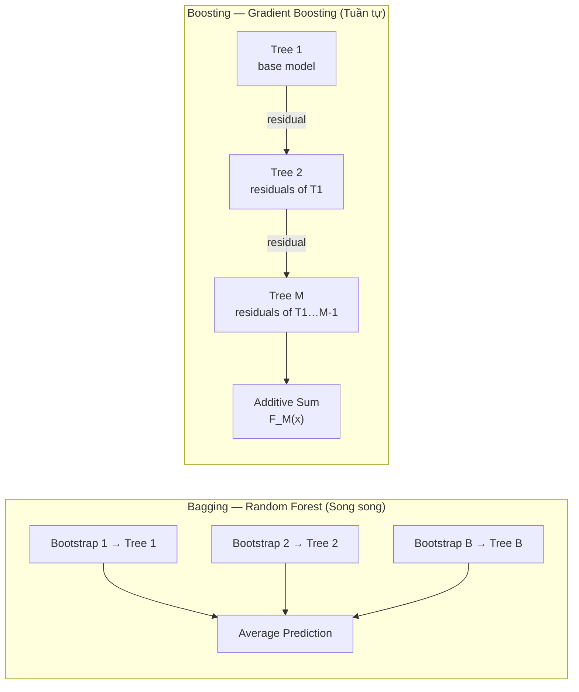
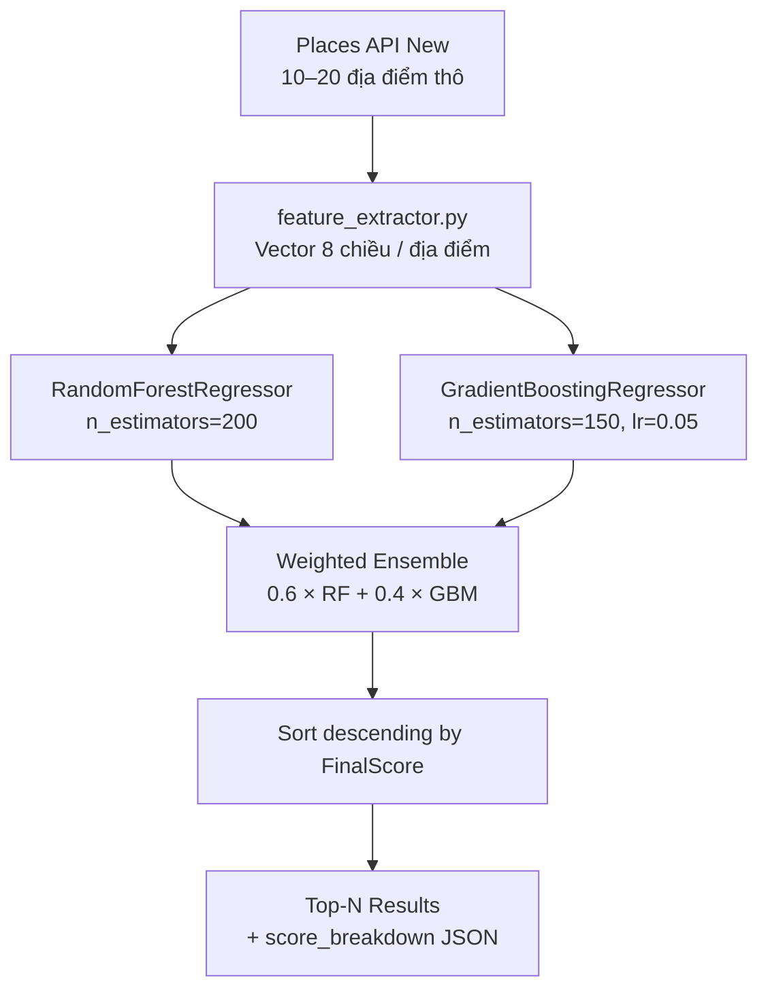
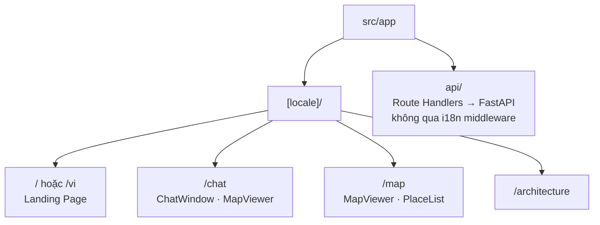
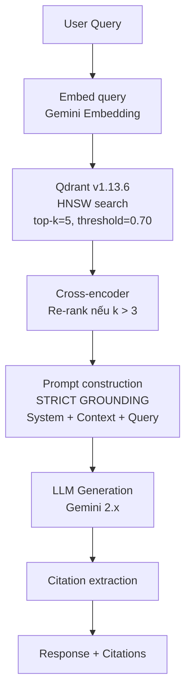
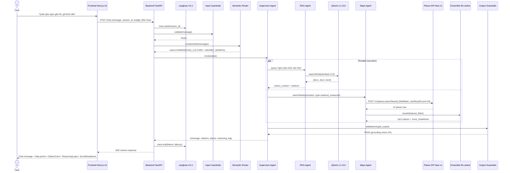

# REQUIREMENTS DOCUMENT
## Ham Ninh Sustainable Tourism AI Assistant

| Trường | Nội dung |
|---|---|
| **Tên dự án** | Ham Ninh Sustainable Tourism AI Assistant |
| **Phiên bản** | v2.0.0 |
| **Ngày** | 17/05/2026 |
| **Chủ đề thuật toán** | Trees, Forests, Bagging & Boosting (Ensemble Methods) |
| **Kiến trúc** | Multi-Agent AI · RAG · Responsible AI (5-Axis) |

---

## MỤC LỤC

1. [Landing Page — Giới thiệu dự án](#1-landing-page--giới-thiệu-dự-án)
2. [Bối cảnh & Mục tiêu](#2-bối-cảnh--mục-tiêu)
3. [Cấu trúc Repository](#3-cấu-trúc-repository)
4. [Tech Stack & Phiên bản chính xác](#4-tech-stack--phiên-bản-chính-xác)
5. [Kiến trúc hệ thống](#5-kiến-trúc-hệ-thống)
6. [Google Places API (New) — Đặc tả tích hợp](#6-google-places-api-new--đặc-tả-tích-hợp)
7. [Ensemble Methods — Ứng dụng ML Core](#7-ensemble-methods--ứng-dụng-ml-core)
8. [5 Trục Responsible AI](#8-5-trục-responsible-ai)
9. [Đặc tả Module Frontend (Next.js 16)](#9-đặc-tả-module-frontend-nextjs-16)
10. [Đặc tả Module Agents (LangGraph)](#10-đặc-tả-module-agents-langgraph)
11. [Đặc tả Module Backend (FastAPI)](#11-đặc-tả-module-backend-fastapi)
12. [End-to-End Workflow](#12-end-to-end-workflow)
13. [Phụ lục: Glossary](#13-phụ-lục-glossary)

---

## 1. Landing Page — Giới thiệu dự án

> Phần này mô tả nội dung và cấu trúc trang giới thiệu dự án (Landing Page), được render tại route `/` của module `frontend/`.

### 1.1 Mục đích

Landing Page là điểm tiếp cận đầu tiên cho người dùng và giám khảo học thuật. Trang này phải truyền tải ba thông điệp cốt lõi: **bản chất AI có trách nhiệm**, **câu chuyện bảo tồn văn hóa**, và **năng lực kỹ thuật** của hệ thống.

### 1.2 Cấu trúc nội dung Landing Page

**Hero Section**

- Tiêu đề chính: *"Hàm Ninh AI Guide — Bảo tồn Di sản. Hỗ trợ Du lịch. Công bằng cho Ngư dân."*
- Mô tả ngắn (≤ 40 từ): Hệ thống Multi-Agent AI đầu tiên kết hợp RAG bảo tồn văn hóa và Ensemble Re-ranking bảo vệ sinh kế tiểu thương làng chài Hàm Ninh, Phú Quốc.
- CTA chính: Nút **"Khám phá ngay"** → route `/chat`; Nút **"Xem kiến trúc"** → route `/architecture`

**Problem Statement Section**

- Ba card vấn đề: Over-tourism & xói mòn văn hóa / Thiên vị kinh tế của nền tảng lớn / Thiếu thông tin di sản địa phương chính xác
- Dẫn chứng số liệu minh họa tác động xã hội

**Solution Section**

- Sơ đồ kiến trúc tổng thể (Mermaid diagram render)
- Ba trụ cột: RAG Agent (Local Guide) / Maps & Service Agent (Concierge) / Ensemble Re-ranker (Fairness Engine)

**Responsible AI Section — 5 Trục**

- Năm card: Reliability / Bias & Fairness / Robustness / Social Impact / Explainability
- Mỗi card: icon, tên trục, một dòng mô tả, metric mục tiêu

**Algorithm Showcase Section**

- Trực quan hóa Ensemble Re-ranking: bar chart hiển thị đóng góp của `local_factor`, `rating`, `distance` vào Final Score
- Giải thích ngắn: Decision Tree → Random Forest (Bagging) → Gradient Boosting (Boosting) → Ensemble Score

**Tech Stack Section**

- Logo grid: Next.js 16 / FastAPI / LangGraph / Qdrant / Google Maps Platform / scikit-learn / RAGAS / Langfuse

**Demo CTA Section**

- Screenshot walkthrough hoặc embedded demo video
- Nút **"Trải nghiệm Demo"** → `/chat`

### 1.3 Non-functional Requirements cho Landing Page

| Metric | Target |
|---|---|
| First Contentful Paint (FCP) | ≤ 1.5s (Cache Components Next.js 16) |
| i18n | Tiếng Việt (default) + Tiếng Anh (`next-intl`) |
| Responsive breakpoints | 375px / 768px / 1280px |
| Accessibility | WCAG 2.2 AA |

---

## 2. Bối cảnh & Mục tiêu

### 2.1 Bối cảnh

Làng chài **Hàm Ninh** (Phú Quốc, Kiên Giang) là di sản văn hóa với nghề biển lâu đời, nổi tiếng với ghẹ Hàm Ninh và mắm tôm truyền thống. Làn sóng du lịch tạo ra hai vấn đề cấu trúc:

- **Economic displacement:** Nền tảng gợi ý du lịch toàn cầu ưu tiên cơ sở có ngân sách marketing lớn, đẩy tiểu thương địa phương (ngư dân, thợ làm mắm, người cao tuổi) ra ngoài luồng doanh thu.
- **Cultural erosion:** Thiếu nguồn thông tin tin cậy về lịch sử, giai thoại, và ý nghĩa văn hóa của các địa danh Hàm Ninh.

### 2.2 Mục tiêu hệ thống

| ID | Mục tiêu | Phân loại |
|---|---|---|
| OBJ-01 | Cung cấp thông tin văn hóa / lịch sử Hàm Ninh chính xác thông qua RAG | Functional |
| OBJ-02 | Hỗ trợ tìm kiếm địa điểm, tuyến đường thực tế thông qua Places API (New) | Functional |
| OBJ-03 | Ưu tiên cơ sở kinh doanh địa phương qua Ensemble Re-ranking | Fairness |
| OBJ-04 | Tuân thủ 5 trục Responsible AI | Ethical |
| OBJ-05 | Mọi gợi ý đều có reasoning trace, kiểm chứng được | Transparency |

### 2.3 Phạm vi

**Trong phạm vi:** Chatbot hỏi đáp đa ngôn ngữ, gợi ý địa điểm có re-ranking, bản đồ tương tác, citation từ RAG, reasoning log, observability dashboard.

**Ngoài phạm vi:** Hệ thống đặt phòng/thanh toán, CRM, fine-tuning LLM từ đầu, mobile native app.

---

## 3. Cấu trúc Repository

```
ham-ninh-ai/
│
├── docs/
│   ├── REQUIREMENTS.md
│   ├── ARCHITECTURE.md
│   ├── API_SPEC.md
│   ├── ETHICAL_AUDIT.md
│   ├── DATA_DICTIONARY.md
│   └── DEPLOYMENT.md
│
├── frontend/                        # Next.js 16.2.6 LTS
│   ├── messages/                    # next-intl message catalogs (KHÔNG đặt trong src/i18n/)
│   │   ├── vi.json
│   │   └── en.json
│   ├── src/
│   │   ├── i18n/
│   │   │   ├── routing.ts           # defineRouting({ locales, defaultLocale, localePrefix })
│   │   │   └── request.ts           # getRequestConfig — load messages theo locale
│   │   ├── app/
│   │   │   ├── [locale]/            # Bắt buộc: mọi page UI nằm dưới dynamic segment locale
│   │   │   │   ├── layout.tsx       # NextIntlClientProvider + setRequestLocale
│   │   │   │   ├── page.tsx         # Landing Page (/)
│   │   │   │   ├── chat/            # /chat
│   │   │   │   ├── map/             # /map
│   │   │   │   └── architecture/    # /architecture
│   │   │   └── api/                 # Route Handlers (ngoài [locale], không qua i18n middleware)
│   │   ├── components/
│   │   │   ├── landing/             # HeroSection, ProblemCard, AlgorithmShowcase
│   │   │   ├── chat/                # ChatWindow, MessageBubble, StreamingText
│   │   │   ├── map/                 # MapViewer (Google Maps JS SDK)
│   │   │   ├── reasoning/           # ReasoningLog, CitationCard, ScoreBreakdown
│   │   │   └── ui/                  # Shared components
│   │   └── lib/
│   │       ├── api-client.ts
│   │       ├── sse-stream.ts
│   │       └── types.ts
│   ├── proxy.ts                     # createMiddleware(routing) — Next.js 16 network boundary
│   ├── next.config.ts               # createNextIntlPlugin() bọc nextConfig
│   ├── package.json
│   └── tsconfig.json
│
├── agents/                          # LangGraph 1.2.0 — Multi-Agent Orchestration
│   ├── graph/
│   │   ├── supervisor.py            # Supervisor Agent + StateGraph
│   │   ├── rag_agent.py             # RAG Agent (Local Guide Worker)
│   │   ├── maps_agent.py            # Maps & Service Agent (Concierge Worker)
│   │   └── state.py                 # AgentState TypedDict
│   ├── tools/
│   │   ├── qdrant_retriever.py      # Qdrant similarity search
│   │   ├── places_nearby.py         # Places API (New): searchNearby
│   │   ├── places_text.py           # Places API (New): searchText
│   │   ├── places_details.py        # Places API (New): Place Details
│   │   ├── routes_matrix.py         # Routes API: computeRouteMatrix
│   │   └── cache_fallback.py        # SQLite circuit breaker fallback
│   ├── routing/
│   │   ├── semantic_router.py       # Intent routing (cosine similarity)
│   │   └── intent_schemas.py        # Intent definitions & utterances
│   ├── guardrails/
│   │   ├── input_guardrails.py      # Prompt injection, topic filter
│   │   └── output_guardrails.py     # Grounding check, content safety
│   ├── ml/
│   │   ├── reranker.py              # Ensemble Re-ranker (RF + GBM)
│   │   ├── feature_extractor.py     # Feature engineering (8 features)
│   │   └── model_artifacts/         # Serialized .joblib files
│   ├── eval/
│   │   ├── ragas_eval.py            # RAGAS 0.4.3 evaluation
│   │   └── test_datasets/           # Golden Q&A datasets
│   ├── checkpointer/
│   │   └── postgres_saver.py        # AsyncPostgresSaver (langgraph-checkpoint-postgres 3.1.0)
│   └── requirements.txt
│
└── backend/                         # FastAPI 0.136.1 — API Gateway
    ├── app/
    │   ├── main.py
    │   ├── routers/
    │   │   ├── chat.py              # POST /chat, GET /chat/stream (SSE)
    │   │   ├── health.py            # GET /health, /health/ready
    │   │   └── admin.py             # eval trigger, trace viewer, ingest
    │   ├── models/
    │   │   ├── request.py           # Pydantic v2 request schemas
    │   │   └── response.py          # Pydantic v2 response schemas
    │   ├── services/
    │   │   ├── agent_service.py
    │   │   ├── langfuse_service.py
    │   │   └── qdrant_service.py
    │   ├── middleware/
    │   │   ├── auth.py
    │   │   ├── rate_limiter.py
    │   │   └── cors.py
    │   └── core/
    │       ├── config.py            # Pydantic BaseSettings
    │       └── logging.py           # structlog
    ├── migrations/                  # Alembic (PostgreSQL 18)
    ├── tests/
    ├── Dockerfile
    ├── compose.yaml                 # Docker Compose canonical filename (2026)
    ├── .env.example                 # Host ports + secrets (copy → .env)
    └── requirements.txt
```

---

## 4. Tech Stack & Phiên bản chính xác

### 4.1 Frontend

| Package | Phiên bản | Ghi chú |
|---|---|---|
| **Next.js** | `16.2.6` | Latest stable (npm, May 2026). Turbopack default. `proxy.ts` thay `middleware.ts`. Cache Components (PPR stable). Agent DevTools experimental (16.2+) |
| **React** | `19.2.6` | Bundled với Next.js 16 |
| **TypeScript** | `6.0.3` | Strict mode bắt buộc |
| **Tailwind CSS** | `4.3.0` | Utility-first, JIT |
| **Vercel AI SDK** | `6.0.184` | SSE streaming, `useChat` / `@ai-sdk/react` |
| **next-intl** | `4.12.0` | i18n (vi / en). App Router: `[locale]` segment + `messages/` + `i18n/routing.ts` + `i18n/request.ts` |
| **Google Maps JS SDK** | `weekly` channel | `@googlemaps/js-api-loader` |

> **Next.js 16 breaking changes cần lưu ý:**
> - `middleware.ts` deprecated → dùng `proxy.ts` ở root (runtime `nodejs`, không hỗ trợ Edge). Nếu cần Edge cho i18n, giữ `middleware.ts` tạm thời cho đến khi next-intl hỗ trợ đầy đủ `proxy.ts`
> - Cache phải explicit: dùng `use cache` directive hoặc Cache Components
> - `experimental.ppr` flag bị xóa hoàn toàn — dùng Cache Components configuration
>
> **next-intl 4.x (Context7 / amannn/next-intl):**
> - Message files: `messages/{locale}.json` (root), **không** `src/i18n/vi.json`
> - Routing config: `src/i18n/routing.ts` (`defineRouting`)
> - Request config: `src/i18n/request.ts` (`getRequestConfig`)
> - Pages: `src/app/[locale]/...` — route groups `(landing)` đặt **bên trong** `[locale]`
> - `proxy.ts`: `createMiddleware(routing)` + matcher loại trừ `/api`, `/_next`, static files
> - `next.config.ts`: `createNextIntlPlugin()` (mặc định trỏ `src/i18n/request.ts`)

### 4.2 Agents

| Package | Phiên bản | Ghi chú |
|---|---|---|
| **Python** | `3.12` | Khuyến nghị; scikit-learn 1.8.0 hỗ trợ 3.11–3.14 |
| **langgraph** | `1.2.0` | PyPI latest. Durable state, `task`/`entrypoint` timeout + `TimeoutPolicy`, `NodeTimeoutError`, `DeltaChannel` (beta) |
| **langgraph-checkpoint-postgres** | `3.1.0` | `PostgresSaver` / `AsyncPostgresSaver` — tách package riêng, gọi `.setup()` trước compile |
| **langchain-core** | `1.4.0` | Base abstractions |
| **qdrant-client** | `1.18.0` | Python SDK; tương thích Qdrant server v1.13.x+ |
| **semantic-router** | `0.0.20` | Intent routing bằng cosine similarity |
| **scikit-learn** | `1.8.0` | Dec 2025. Free-threaded CPython support. `RandomForestRegressor`, `GradientBoostingRegressor` |
| **ragas** | `0.4.3` | Jan 2026. Metrics: Faithfulness, Answer Relevance, Context Recall, Context Precision |
| **nemoguardrails** | `0.17.0` | Input/Output Guardrails |
| **langfuse** | `4.6.1` | May 2026. SDK v4 (full rewrite Mar 2026). Traces, cost, latency |
| **google-maps-places** | `0.8.0` | Python client cho Places API (New) v1 |

### 4.3 Backend

| Package | Phiên bản | Ghi chú |
|---|---|---|
| **FastAPI** | `0.136.1` | Latest May 2026. Async-first, SSE native, Pydantic v2 |
| **Uvicorn** | `0.47.0` | ASGI server |
| **asyncpg** | `0.31.0` | Async PostgreSQL driver |
| **redis** (redis-py) | `7.4.0` | Async support, semantic caching |
| **structlog** | `25.5.0` | Structured logging |
| **slowapi** | `0.1.9` | Rate limiting middleware |
| **alembic** | `1.18.4` | Database migrations |
| **Pydantic** | `2.13.4` | Schema validation, BaseSettings |

### 4.4 Infrastructure

| Service | Version / Image | Vai trò |
|---|---|---|
| **Qdrant** | `v1.13.6` (Docker: `qdrant/qdrant:v1.13.6`) | Vector database. Gridstore storage engine (RocksDB deprecated từ v1.17). HNSW index. REST + gRPC |
| **PostgreSQL** | `18` (`postgres:18`, patch `18.3` Feb 2026) | Relational data + LangGraph checkpointing (`langgraph-checkpoint-postgres` 3.1.0) |
| **Redis Open Source** | `8.0` | Tích hợp native Redis Search, JSON, time series. Semantic cache, rate limit, session |
| **Docker Compose** | `v2.x` | File **`compose.yaml`** (canonical; `docker-compose.yml` legacy). Không dùng field `version:` |

### 4.5 Google Maps Platform

| API | Base URL | Vai trò |
|---|---|---|
| **Places API (New)** | `https://places.googleapis.com/v1` | Nearby Search, Text Search, Place Details, Autocomplete, AI Summaries (GA) |
| **Routes API** | `https://routes.googleapis.com/v2` | Route Matrix (distance/duration) |
| **Maps JavaScript API** | `https://maps.googleapis.com/maps/api/js` | Frontend map rendering |

---

## 5. Kiến trúc hệ thống

### 5.1 Sơ đồ tổng thể



### 5.2 Agent State Transitions



### 5.3 LangGraph Node Topology



---

## 6. Google Places API (New) — Đặc tả tích hợp

### 6.1 Tổng quan

Places API (New) hoạt động trên infrastructure Google Cloud, là thế hệ thay thế cho Places API (Legacy). Base URL: `https://places.googleapis.com/v1`. Hỗ trợ API Key và OAuth 2.0.

Điểm khác biệt quan trọng so với Legacy API:

- **Field Mask bắt buộc** (`X-Goog-FieldMask` header): chỉ trả về fields được chỉ định, tối ưu chi phí billing
- **AI-powered Summaries (GA)**: Place Summary, Review Summary, Area Summary
- **180+ place types** mới cho filtering
- **Search along route (GA)**: tìm địa điểm dọc tuyến đường định sẵn
- **`googleMapsTypeLabel`**: type label bản địa hóa theo ngôn ngữ request

### 6.2 Endpoints sử dụng

**Nearby Search (New)**

- Endpoint: `POST https://places.googleapis.com/v1/places:searchNearby`
- Mục đích: Tìm địa điểm trong bán kính từ tọa độ người dùng
- Field mask yêu cầu: `places.id, places.displayName, places.formattedAddress, places.rating, places.userRatingCount, places.priceLevel, places.types, places.location, places.currentOpeningHours, places.accessibilityOptions, places.googleMapsUri`
- `maxResultCount`: tối đa 20
- `rankPreference`: `POPULARITY` (default) hoặc `DISTANCE`

**Text Search (New)**

- Endpoint: `POST https://places.googleapis.com/v1/places:searchText`
- Mục đích: Tìm địa điểm theo từ khóa văn bản (VD: "quán ghẹ Hàm Ninh")
- Bổ sung field: `places.regularOpeningHours`
- Hỗ trợ: `searchAlongRouteParameters`, `minRating`, `priceLevels` filter

**Place Details (New)**

- Endpoint: `GET https://places.googleapis.com/v1/places/{place_id}`
- Mục đích: Thông tin chi tiết sau khi có `place_id`
- Field bổ sung: `editorialSummary, reviews, photos, paymentOptions`
- AI Summaries: `generativeSummary, reviewSummary, areaSummary` (GA)

**Autocomplete (New)**

- Endpoint: `POST https://places.googleapis.com/v1/places:autocomplete`
- Mục đích: Gợi ý địa điểm khi người dùng gõ trên Frontend
- Hỗ trợ: `includedPrimaryTypes` filter

### 6.3 Field Mask Strategy



### 6.4 Mapping Fields → Ensemble Re-ranker Features

| Trường Places API (New) | Feature | Transformation |
|---|---|---|
| `rating` | `rating` | float [1.0, 5.0], direct |
| `userRatingCount` | `review_count_log` | `log(count + 1)` |
| `priceLevel` (enum) | `price_level` | FREE=0 → VERY_EXPENSIVE=4 |
| `currentOpeningHours.openNow` | `is_open_now` | bool → int |
| `location` (lat/lng) | `distance_meters` | Haversine từ user coordinates |
| `accessibilityOptions.wheelchairAccessibleEntrance` | `accessibility_score` (partial) | bool → float |
| `types` | `category_match` | cosine sim(embed(query), embed(types)) |
| *(internal metadata DB)* | `local_factor` | Không từ API |

### 6.5 Circuit Breaker — Fallback



---

## 7. Ensemble Methods — Ứng dụng ML Core

### 7.1 Bài toán Re-ranking

**Vấn đề:** Places API (New) mặc định xếp hạng theo `POPULARITY` — phản ánh lượng review và engagement, có lợi cho chuỗi lớn có ngân sách marketing, bất lợi cho tiểu thương địa phương.

**Giải pháp:** Ensemble model (Random Forest + Gradient Boosting) re-rank kết quả Places API, đưa `local_factor` vào hàm scoring để bảo vệ cơ sở kinh doanh bản địa.

### 7.2 Feature Space (8 chiều)

| Feature | Type | Nguồn |
|---|---|---|
| `rating` | float | Places API (New) |
| `review_count_log` | float (log-scaled) | Places API (New) |
| `distance_meters` | float | Haversine(user, place) |
| `price_level` | int [0–4] | Places API (New) |
| `is_open_now` | int {0, 1} | Places API (New) |
| `local_factor` | float [0.0–1.0] | Internal metadata DB |
| `category_match` | float [0.0–1.0] | Cosine sim(query ↔ types) |
| `accessibility_score` | float [0.0–1.0] | Internal + API |

### 7.3 `local_factor` — Nhân tố công bằng địa phương

| Tiêu chí | Điểm |
|---|---|
| Đăng ký hộ kinh doanh cá thể địa phương | +0.40 |
| Chủ sở hữu là hộ gia đình ngư dân | +0.25 |
| Chứng nhận nghề truyền thống địa phương | +0.20 |
| Sử dụng lao động người cao tuổi / người khuyết tật | +0.15 |

`local_factor = min(tổng điểm, 1.0)`

### 7.4 Toán học Bagging — Random Forest

**Nguyên lý:** Mỗi Decision Tree $T_b$ trong Random Forest được huấn luyện trên một **bootstrap sample** (lấy mẫu có hoàn lại) kết hợp **feature bagging** (chọn ngẫu nhiên $\sqrt{p}$ features tại mỗi split). Prediction cuối là trung bình:

$$\hat{f}_{\text{RF}}(\mathbf{x}) = \frac{1}{B} \sum_{b=1}^{B} T_b(\mathbf{x})$$

trong đó $B = 200$ cây, các cây **độc lập** nhau (song song).

**Tác dụng:** Giảm **variance** — đặc biệt hiệu quả khi feature space có noise (ranking Places API không ổn định giữa các request).

**Cấu hình:** `n_estimators=200, max_features="sqrt", max_depth=8, min_samples_leaf=5`

### 7.5 Toán học Boosting — Gradient Boosting

**Nguyên lý:** Mỗi cây mới $T_m$ được tối ưu hóa **tuần tự** để giảm residual của model hiện tại $F_{m-1}$:

$$F_m(\mathbf{x}) = F_{m-1}(\mathbf{x}) + \eta \cdot T_m\!\left(\mathbf{x};\, \arg\min_{\Theta} \sum_{i} L\!\left(y_i,\, F_{m-1}(\mathbf{x}_i) + T_m(\mathbf{x}_i;\Theta)\right)\right)$$

trong đó $\eta = 0.05$ (learning rate), hàm loss $L$ là MSE.

**Tác dụng:** Giảm **bias** — nắm bắt pattern phi tuyến giữa `local_factor` và perceived experience quality.

**Cấu hình:** `n_estimators=150, learning_rate=0.05, max_depth=4, subsample=0.8`

### 7.6 So sánh Bagging vs Boosting



| Tiêu chí | Bagging (RF) | Boosting (GBM) |
|---|---|---|
| Huấn luyện | Song song | Tuần tự |
| Giảm | Variance | Bias |
| Chịu noise | Robust | Nhạy hơn |
| Tốc độ inference | Nhanh | Chậm hơn một chút |
| Vai trò | Bao quát feature space | Tinh chỉnh thứ hạng |

### 7.7 Final Ensemble Score

$$\text{FinalScore} = 0.6 \times \hat{f}_{\text{RF}}(\mathbf{x}) + 0.4 \times F_M(\mathbf{x})$$

Trọng số 0.6/0.4 được xác định qua 5-fold cross-validation trên tập nhãn do chuyên gia địa phương gán. `rf.feature_importances_` được expose ra Frontend để render `<ScoreBreakdown>` (Explainability).

### 7.8 Pipeline Re-ranking



---

## 8. 5 Trục Responsible AI

### 8.1 Trục 1 — Reliability (Tính tin cậy)

**Mục tiêu:** Nhất quán, giảm hallucination, kết quả kiểm chứng được.

| ID | Yêu cầu | Tiêu chí chấp nhận |
|---|---|---|
| REL-01 | RAG Agent áp dụng **Strict Grounding**: chỉ trả lời dựa trên documents từ Qdrant, không dùng parametric knowledge của LLM | RAGAS Faithfulness ≥ 0.85 |
| REL-02 | **RAGAS 0.4.3** tích hợp CI/CD, auto-evaluate sau mỗi cập nhật Qdrant collection | Answer Relevance ≥ 0.80; Context Recall ≥ 0.75 |
| REL-03 | **Semantic Cache** (Redis 8.0): query có cosine similarity ≥ 0.95 với cached query → trả cache | Cache hit rate ≥ 30% peak traffic |
| REL-04 | Mọi phản hồi văn hóa/lịch sử kèm **Citation** (tên tài liệu + chunk index) | 100% RAG responses có citation |

### 8.2 Trục 2 — Bias & Fairness (Xử lý thiên vị)

**Mục tiêu:** Công bằng kinh tế, ngôn ngữ, vùng miền.

| ID | Yêu cầu | Tiêu chí chấp nhận |
|---|---|---|
| BIAS-01 | **Economic fairness:** Ensemble Re-ranker đảm bảo ≥ 40% kết quả top-5 là cơ sở địa phương (`local_factor > 0.5`) | Local business top-5 ≥ 40% |
| BIAS-02 | **Language fairness:** Nhận diện tiếng Việt có dấu, không dấu, phương ngữ Nam Bộ | Intent accuracy ≥ 90% trên test set phương ngữ |
| BIAS-03 | **Source diversity:** Qdrant collection từ ≥ 3 nguồn khác nhau (báo chí, dân gian, học thuật) | Diversity score ≥ 3 sources per topic |
| BIAS-04 | **Monthly fairness audit:** Script so sánh tỷ lệ local vs chain business trong log kết quả | Audit log Langfuse, review mỗi 30 ngày |

### 8.3 Trục 3 — Robustness (Khả năng chịu lỗi)

**Mục tiêu:** Chịu tấn công, lỗi hạ tầng, dữ liệu nhiễu.

| ID | Yêu cầu | Tiêu chí chấp nhận |
|---|---|---|
| ROB-01 | **Input Guardrails:** Phát hiện và chặn Prompt Injection | Block rate ≥ 99% trên injection test suite |
| ROB-02 | **Topic Filter:** Từ chối query ngoài phạm vi du lịch / văn hóa Hàm Ninh | Precision ≥ 0.95 trên off-topic test set |
| ROB-03 | **Output Grounding Check:** Maps Agent không trả địa điểm ngoài Places API response | 0% hallucinated locations |
| ROB-04 | **Circuit Breaker:** Places API timeout > 3s hoặc 3 lỗi liên tiếp → fallback SQLite | Activation 100% đúng điều kiện |
| ROB-05 | **Durable State (PostgresSaver):** LangGraph checkpoint PostgreSQL 18 (`langgraph-checkpoint-postgres` 3.1.0), phục hồi sau server restart | Recovery test pass 100% |
| ROB-06 | **Per-node timeout** (LangGraph 1.2+): Maps Agent node timeout 10s; `NodeTimeoutError` → thông báo thân thiện | P99 latency < 8s |

### 8.4 Trục 4 — Social Impact (Tác động xã hội)

**Mục tiêu:** Bảo vệ sinh kế và quyền tiếp cận của nhóm yếu thế.

| ID | Nhóm | Yêu cầu | Tiêu chí chấp nhận |
|---|---|---|---|
| SOC-01 | Tiểu thương / ngư dân | `local_factor` metadata gắn nhãn cho ≥ 80% cơ sở địa phương đã đăng ký | Coverage ≥ 80% |
| SOC-02 | Người cao tuổi / người khuyết tật | Accessibility warning khi `accessibilityOptions.wheelchairAccessibleEntrance = false` và địa điểm yêu cầu di chuyển khó | Warning 100% khi điều kiện đúng |
| SOC-03 | Ngân sách thấp | `price_level` filter hoạt động; ưu tiên `PRICE_LEVEL_INEXPENSIVE` khi user chọn budget thấp | Filter chính xác 100% |
| SOC-04 | Người không quen công nghệ | Voice input (Web Speech API); response đơn giản ≤ 100 từ | Voice hoạt động Chrome/Safari |
| SOC-05 | Cộng đồng văn hóa | RAG Agent cung cấp cultural context trước khi gợi ý dịch vụ thương mại | 100% HYBRID responses có cultural context |

### 8.5 Trục 5 — Explainability (Tính minh bạch)

**Mục tiêu:** AI không là hộp đen; người dùng kiểm chứng và hiểu được gợi ý.

| ID | Yêu cầu | Triển khai |
|---|---|---|
| EXP-01 | **Reasoning Log UI:** Accordion "Tại sao gợi ý này?" hiển thị `reasoning_log` từ `AgentState` | `<ReasoningLog>` component |
| EXP-02 | **Citation bắt buộc:** Format `[Nguồn: <tên tài liệu>, chunk <N>]` dưới mỗi thông tin văn hóa | `<CitationCard>` component |
| EXP-03 | **Re-ranking explanation:** Bar chart đóng góp từng feature vào FinalScore (`rf.feature_importances_`) | `<ScoreBreakdown>` component |
| EXP-04 | **Langfuse 4.6.1 traces:** Toàn bộ reasoning trace, tool calls, latency, cost per session | 100% requests có trace |
| EXP-05 | **Score breakdown JSON:** Mỗi địa điểm kèm `{rf_score, gbm_score, local_factor, final_score, rank}` | Accessible via API response + hover UI |

---

## 9. Đặc tả Module Frontend (Next.js 16)

### 9.1 Route Structure (App Router + next-intl 4.x)

URL thực tế có prefix locale (mặc định `localePrefix: 'as-needed'` → locale `vi` có thể không có prefix):



### 9.2 Core Components

| Component | Trang | Mô tả |
|---|---|---|
| `HeroSection` | `/` | Tagline, CTA buttons, hero illustration |
| `AlgorithmShowcase` | `/` | Bar chart Ensemble Re-ranking |
| `ResponsibleAIGrid` | `/` | 5 cards / 5 trục Responsible AI |
| `ChatWindow` | `/chat` | SSE streaming, typing indicator, message history |
| `MapViewer` | `/chat`, `/map` | Google Maps JS SDK, auto-pin gợi ý |
| `CitationCard` | `/chat` | Nguồn RAG, expandable |
| `ReasoningLog` | `/chat` | Accordion: `reasoning_log` từ AgentState |
| `ScoreBreakdown` | `/chat`, `/map` | Hover card: rf, gbm, local_factor, final |
| `AccessibilityBadge` | `/chat`, `/map` | Warning khi `accessibility_score < 0.4` |
| `PriceFilter` | `/chat` | Dropdown: Free / Inexpensive / Moderate / Expensive |

### 9.3 Next.js 16 Specific

**`proxy.ts`** (root level): `createMiddleware(routing)` cho locale detection/redirect; Route Handler `/api/*` proxy → `http://localhost:48721` (host port từ `compose.yaml`, không phải `8000` trên host).

**Cache strategy:**
- `HeroSection`, `AlgorithmShowcase`, `ResponsibleAIGrid` → `use cache` directive (statically cached)
- `ChatWindow`, `MapViewer` → dynamic, không cache

**Turbopack:** default bundler, không cần `--turbo` flag, 2–5× faster builds so với Webpack.

**`agentDevTools`** (experimental 16.2+): AI agents đọc React DevTools và Next.js diagnostics trong dev mode — hữu ích khi debug SSE streaming.

### 9.4 i18n (next-intl 4.12.0)

| Thành phần | Đường dẫn | Vai trò |
|---|---|---|
| Messages `vi` (default) | `messages/vi.json` | ICU message catalog |
| Messages `en` | `messages/en.json` | ICU message catalog |
| Routing | `src/i18n/routing.ts` | `defineRouting({ locales: ['vi','en'], defaultLocale: 'vi', localePrefix: 'as-needed' })` |
| Request config | `src/i18n/request.ts` | `getRequestConfig` — import messages theo locale |
| Middleware | `proxy.ts` (root) | `createMiddleware(routing)` |
| Plugin | `next.config.ts` | `createNextIntlPlugin()` |

**Ví dụ `routing.ts`:**

```typescript
import {defineRouting} from 'next-intl/routing';

export const routing = defineRouting({
  locales: ['vi', 'en'],
  defaultLocale: 'vi',
  localePrefix: 'as-needed'
});
```

**Ví dụ `request.ts`:**

```typescript
import {getRequestConfig} from 'next-intl/server';
import {routing} from './routing';

export default getRequestConfig(async ({requestLocale}) => {
  let locale = await requestLocale;
  if (!locale || !routing.locales.includes(locale as 'vi' | 'en')) {
    locale = routing.defaultLocale;
  }
  return {
    locale,
    messages: (await import(`../../messages/${locale}.json`)).default
  };
});
```

**Link nội bộ:** dùng `Link` / `useRouter` / `redirect` từ `@/i18n/routing` (hoặc `createNavigation(routing)`), không dùng `next/link` trực tiếp cho page có locale.

### 9.5 Non-functional Requirements

| Metric | Target |
|---|---|
| Landing Page FCP | ≤ 1.5s |
| Chat response First Token | ≤ 2s |
| Map tile load | ≤ 1s |
| WCAG Compliance | 2.2 AA |
| Mobile viewport | 375px+ |
| Browser support | Chrome 120+, Safari 17+, Firefox 120+ |

---

## 10. Đặc tả Module Agents (LangGraph)

### 10.1 Intent Classification — Semantic Router

$$\text{cosine}(\mathbf{q}, \mathbf{u}) = \frac{\mathbf{q} \cdot \mathbf{u}}{\|\mathbf{q}\| \cdot \|\mathbf{u}\|}$$

| Intent | Ngưỡng | Ví dụ utterances |
|---|---|---|
| `CULTURE_HISTORY` | ≥ 0.82 | "Làng chài Hàm Ninh có từ bao giờ?", "Ý nghĩa lễ hội cúng biển" |
| `FOOD_CULTURE` | ≥ 0.82 | "Mắm Hàm Ninh khác gì mắm thường?", "Ghẹ ở đây đặc biệt thế nào?" |
| `NEARBY_SEARCH` | ≥ 0.80 | "Nhà hàng gần tôi nhất", "Quán hải sản ngon" |
| `ROUTE_NAVIGATION` | ≥ 0.80 | "Từ bến tàu đến làng chài bao xa?", "Đi thế nào?" |
| `OFF_TOPIC` | — | Query không khớp intent trên |

Nếu không có intent vượt ngưỡng → Supervisor quyết định bằng LLM reasoning.

### 10.2 RAG Agent — Retrieval Pipeline



**Qdrant Collections:**

| Collection | Nội dung | Vector Dim | Distance |
|---|---|---|---|
| `hamninh_culture` | Lịch sử, di tích, giai thoại | 768 | Cosine |
| `hamninh_food` | Ẩm thực, nghề truyền thống | 768 | Cosine |
| `hamninh_businesses` | Metadata cơ sở kinh doanh địa phương | 768 | Cosine |

### 10.3 Maps & Service Agent — Tools

| Tool | API Endpoint | Điều kiện gọi |
|---|---|---|
| `places_nearby` | `POST /v1/places:searchNearby` | Query có tọa độ người dùng |
| `places_text` | `POST /v1/places:searchText` | Query có từ khóa địa điểm |
| `places_details` | `GET /v1/places/{place_id}` | Cần chi tiết sau khi có place_id |
| `routes_matrix` | `POST /v2/distanceMatrix` | Query về khoảng cách / thời gian |
| `cache_fallback` | SQLite internal | Circuit breaker kích hoạt |

### 10.4 Guardrails

**Input Guardrails:**

| Rule | Mô tả | Hành động |
|---|---|---|
| `prompt_injection` | Pattern "Ignore instructions", roleplay manipulation | Block + safe decline |
| `topic_filter` | Cosine sim(query, topic) < 0.40 | Redirect với thông báo scope |
| `pii_filter` | Thông tin cá nhân nhạy cảm trong input | Sanitize |

**Output Guardrails:**

| Rule | Mô tả | Hành động |
|---|---|---|
| `grounding_check` | Địa điểm trong response phải tồn tại trong Places API result set | Remove địa điểm không hợp lệ |
| `content_safety` | Nội dung không phù hợp | Block |
| `hallucination_flag` | RAG tham chiếu thông tin ngoài retrieved context | Flag + disclaimer |

---

## 11. Đặc tả Module Backend (FastAPI)

### 11.1 API Endpoints

| Method | Endpoint | Mô tả | Auth |
|---|---|---|---|
| `POST` | `/chat` | Gửi message, nhận response đầy đủ | API Key |
| `GET` | `/chat/stream` | SSE streaming response | API Key |
| `GET` | `/health` | Liveness check | None |
| `GET` | `/health/ready` | Readiness: Qdrant + PostgreSQL + Redis | None |
| `POST` | `/admin/eval/trigger` | Kích hoạt RAGAS evaluation pipeline | Admin JWT |
| `GET` | `/admin/traces` | Langfuse traces summary | Admin JWT |
| `POST` | `/admin/ingest` | Ingest documents vào Qdrant | Admin JWT |

### 11.2 Request Schema (Pydantic v2)

**ChatRequest:**

| Field | Type | Mô tả |
|---|---|---|
| `session_id` | `str` (UUID) | LangGraph checkpoint identifier |
| `message` | `str` (1–2000 chars) | User query |
| `language` | `Literal["vi","en"]` | Output language, default "vi" |
| `budget_filter` | `Literal["free","low","medium","high","any"]` | Places price filter, default "any" |
| `user_location` | `LatLng \| None` | Tọa độ người dùng (opt-in) |
| `accessibility_required` | `bool` | Ưu tiên địa điểm accessible |

### 11.3 Response Schema (Pydantic v2)

**ChatResponse:**

| Field | Type | Mô tả |
|---|---|---|
| `session_id` | `str` | Echo session_id |
| `message` | `str` | Main response text |
| `citations` | `list[Citation]` | Nguồn RAG kèm chunk index |
| `places` | `list[PlaceResult]` | Địa điểm sau re-ranking |
| `reasoning_log` | `list[str]` | Chuỗi suy luận Supervisor |
| `intent` | `str` | Intent được phân loại |
| `langfuse_trace_id` | `str \| None` | Trace ID |
| `latency_ms` | `int` | End-to-end latency |

**PlaceResult:**

| Field | Type | Mô tả |
|---|---|---|
| `place_id` | `str` | Google Place ID |
| `display_name` | `str` | Tên địa điểm |
| `formatted_address` | `str` | Địa chỉ |
| `rating` | `float \| None` | Rating |
| `price_level` | `int \| None` | 0–4 |
| `local_factor` | `float` | [0–1] |
| `final_score` | `float` | Ensemble score |
| `score_breakdown` | `dict` | `{rf_score, gbm_score, feature_importances}` |
| `accessibility_score` | `float` | [0–1] |
| `accessibility_warning` | `str \| None` | Cảnh báo địa hình |
| `google_maps_uri` | `str` | Google Maps deep link |

### 11.4 Observability (Langfuse 4.6.1)

> SDK v4 là rewrite hoàn toàn (Mar 2026). Migration guide bắt buộc khi upgrade từ v3.x.

| Metric | Mô tả |
|---|---|
| Request latency P50/P95/P99 | End-to-end và per-node |
| LLM token usage + cost | Prompt + completion + estimated cost |
| RAGAS Faithfulness per request | Từ evaluation pipeline |
| `local_factor` distribution top-5 | Tỷ lệ local vs chain theo thời gian |
| Cache hit rate | Redis 8.0 semantic cache |
| Circuit breaker activation count | Places API failure events |

### 11.5 Infrastructure — `compose.yaml`

> **Tên file (2026):** Docker Compose ưu tiên **`compose.yaml`** (hoặc `compose.yml`). `docker-compose.yml` vẫn được nhận diện nhưng là legacy — dự án chỉ dùng `compose.yaml`.

**Nguyên tắc port:** Trong Docker network, service gọi nhau bằng **cổng container chuẩn** (`8000`, `5432`, …). Chỉ **publish ra host** dùng cổng hiếm (block `47xxx`) để tránh conflict với Postgres/Redis/Qdrant/API dev khác trên máy.

| Service | Image | Container port | Host port (mặc định) | Biến `.env` |
|---|---|---|---|---|
| `backend` | Custom Dockerfile | `8000` | **`48721`** | `HN_BACKEND_HOST_PORT` |
| `postgres` | `postgres:18` | `5432` | **`47543`** | `HN_POSTGRES_HOST_PORT` |
| `redis` | `redis:8.0` | `6379` | **`47379`** | `HN_REDIS_HOST_PORT` |
| `qdrant` | `qdrant/qdrant:v1.13.6` | `6333` (REST), `6334` (gRPC) | **`46333`**, **`46334`** | `HN_QDRANT_REST_HOST_PORT`, `HN_QDRANT_GRPC_HOST_PORT` |

**Kết nối từ host (dev):**

| Mục đích | URL |
|---|---|
| FastAPI (Swagger) | `http://localhost:48721` |
| PostgreSQL | `postgresql://...@localhost:47543/ham_ninh` |
| Redis | `redis://localhost:47379/0` |
| Qdrant REST | `http://localhost:46333` |

**Kết nối giữa container (không đổi):** `backend` → `postgres:5432`, `redis:6379`, `qdrant:6333`.

**`.env.example` (trích):**

```env
HN_BACKEND_HOST_PORT=48721
HN_POSTGRES_HOST_PORT=47543
HN_REDIS_HOST_PORT=47379
HN_QDRANT_REST_HOST_PORT=46333
HN_QDRANT_GRPC_HOST_PORT=46334
```

**`compose.yaml` (trích `ports`):**

```yaml
services:
  backend:
    ports:
      - "${HN_BACKEND_HOST_PORT:-48721}:8000"
  postgres:
    ports:
      - "${HN_POSTGRES_HOST_PORT:-47543}:5432"
  redis:
    ports:
      - "${HN_REDIS_HOST_PORT:-47379}:6379"
  qdrant:
    ports:
      - "${HN_QDRANT_REST_HOST_PORT:-46333}:6333"
      - "${HN_QDRANT_GRPC_HOST_PORT:-46334}:6334"
```

Lệnh: `docker compose up -d` (tự đọc `compose.yaml` ở thư mục hiện tại).

---

## 12. End-to-End Workflow



---

## 13. Phụ lục: Glossary

| Thuật ngữ | Giải thích |
|---|---|
| **RAG** (Retrieval-Augmented Generation) | Kiến trúc kết hợp truy xuất tài liệu và sinh ngôn ngữ |
| **Multi-Agent System** | Hệ thống gồm nhiều AI agent chuyên biệt phối hợp |
| **Supervisor Pattern** | Kiến trúc agent Supervisor điều phối Worker agents |
| **Vector Database** | Cơ sở dữ liệu lưu embedding vectors, hỗ trợ similarity search |
| **Embedding** | Biểu diễn văn bản dưới dạng dense vector phản ánh ngữ nghĩa |
| **Cosine Similarity** | Độ đo tương đồng vector, range [-1, 1] |
| **Semantic Router** | Định tuyến intent dựa trên semantic similarity |
| **Guardrails** | Hàng rào kiểm soát Input/Output của LLM |
| **Prompt Injection** | Tấn công chèn lệnh độc hại vào input LLM |
| **Circuit Breaker** | Pattern tự động ngắt kết nối khi service lỗi, chuyển fallback |
| **Strict Grounding** | Ràng buộc LLM chỉ dùng context được cung cấp |
| **Re-ranking** | Sắp xếp lại thứ hạng kết quả theo tiêu chí tùy chỉnh |
| **Bagging** | Bootstrap Aggregation — ensemble song song từ nhiều model độc lập |
| **Boosting** | Ensemble tuần tự, mỗi model học từ residual của model trước |
| **Random Forest** | Ensemble Decision Trees với bagging + feature sampling |
| **Gradient Boosting** | Boosting tối ưu hóa residual bằng gradient descent trên function space |
| **Feature Engineering** | Tạo và lựa chọn features phù hợp cho ML model |
| **local_factor** | Nhân tố tùy chỉnh đo mức độ bản địa của cơ sở kinh doanh |
| **Durable State** | Trạng thái agent lưu persistent, phục hồi sau sự cố |
| **Observability** | Khả năng quan sát hành vi hệ thống qua metrics, logs, traces |
| **SSE** (Server-Sent Events) | Giao thức streaming một chiều server → client |
| **RAGAS** | Framework đánh giá RAG pipeline (Faithfulness, Answer Relevance…) |
| **Langfuse** | Nền tảng observability chuyên biệt cho LLM applications |
| **Faithfulness** | RAGAS metric: response trung thực với retrieved context |
| **Field Mask** | Places API (New): chỉ định fields cần trả về, giảm cost |
| **HNSW** | Hierarchical Navigable Small World — thuật toán index vector |
| **Per-node timeout** | LangGraph 1.2+: giới hạn thời gian thực thi mỗi node/task (`TimeoutPolicy`, `NodeTimeoutError`) |
| **Bootstrap Sample** | Tập mẫu lấy ngẫu nhiên có hoàn lại từ tập gốc (dùng trong Bagging) |
| **Residual** | Sai lệch còn lại giữa prediction và ground truth (dùng trong Boosting) |
| **Variance** | Độ nhạy của model với biến động tập huấn luyện |
| **Bias** | Sai lệch hệ thống giữa prediction trung bình và giá trị thực |
| **Places API (New)** | Thế hệ mới Google Places API, base URL `places.googleapis.com/v1` |
| **PostgresSaver** | `langgraph-checkpoint-postgres`: checkpoint provider dùng PostgreSQL 18 |
| **Cache Components** | Next.js 16: explicit cache control thay implicit caching |
| **proxy.ts** | Next.js 16: network boundary file thay `middleware.ts` |
| **Gridstore** | Qdrant v1.13+: storage engine thay thế RocksDB |
| **DeltaChannel** | LangGraph 1.2+ (beta): channel type lưu incremental delta thay full state |

---

*Tài liệu soạn theo chuẩn Software Requirements Specification. Mọi thay đổi phải được version và peer-review trước khi áp dụng.*
