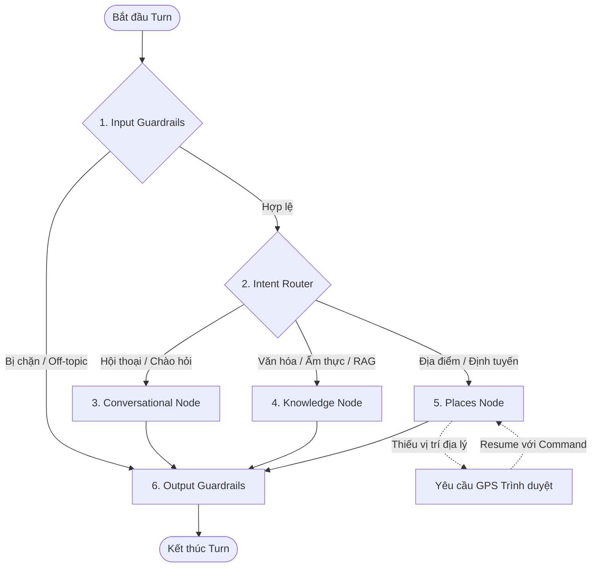

# Báo Cáo Đánh Giá Hệ Thống & Tổng Quan Codebase (Codebase Audit & Architecture Report)
**Ngày thực hiện:** 11/06/2026  
**Trạng thái codebase:** Hoàn thành tốt, 123/123 bài kiểm thử cốt lõi backend vượt qua, frontend compile thành công.

Tài liệu này cung cấp cái nhìn toàn cảnh về kiến trúc hệ thống, luồng dữ liệu hiện tại, danh sách chi tiết các mô-đun trong codebase, và đối chiếu mức độ tuân thủ so với các yêu cầu tại [REQUIREMENTS.md](file:///home/thanhnndev/develop/projects/citd-hk1-project/docs/REQUIREMENTS.md) và [agent_orchestration.md](file:///home/thanhnndev/develop/projects/citd-hk1-project/backend/docs/agent_orchestration.md).

---

## 1. Tổng Quan Codebase (Codebase Overview)

Dự án **Ham Ninh AI Guide** được phát triển theo mô hình ứng dụng web hiện đại chia tách rõ ràng giữa Backend dịch vụ AI và Frontend tương tác người dùng:
*   **Backend (Python):** Sử dụng **FastAPI** làm khung ứng dụng API và **LangGraph** để xây dựng trạng thái điều phối Agent dạng đồ thị có hướng (Directed Acyclic Graph - DAG). Hạ tầng dữ liệu bao gồm **Qdrant** làm cơ sở dữ liệu Vector lưu trữ dữ liệu văn hóa/lịch sử và **PostgreSQL** để checkpoint bộ nhớ hội thoại.
*   **Frontend (Next.js/React):** Sử dụng **Next.js App Router** với ngôn ngữ **TypeScript**. Giao diện phong cách hiện đại tích hợp bản đồ tương tác **Google Maps SDK** để hiển thị vị trí thực tế của địa điểm và bằng chứng khả năng tiếp cận.

---

## 2. Kiến Trúc Hệ Thống (Architecture)

Kiến trúc AI của dự án vận hành duy nhất một đồ thị trạng thái tên là **`HamNinhGraph`** quản lý toàn bộ các khâu từ kiểm duyệt an toàn, định tuyến ý định cho đến thực thi hành động chuyên biệt.

### Sơ đồ luồng đồ thị trạng thái:

---

## 3. Luồng Hoạt Động Hiện Tại (Current Flows)

### 3.1. Luồng RAG Văn Hóa - Lịch Sử (Knowledge Node Flow)
1.  **Nhận câu hỏi:** Người dùng hỏi về văn hóa/lịch sử/món ăn Hàm Ninh.
2.  **Truy vấn bộ nhớ đệm (Semantic Cache):** Kiểm tra xem câu hỏi tương tự đã có câu trả lời sẵn trong bộ nhớ đệm ngữ nghĩa chưa. Nếu có (hit), trả về ngay.
3.  **Truy xuất hỗn hợp (Hybrid Retrieval):** Tìm kiếm song song BM25 (từ khóa) và Vector Search (ngữ nghĩa) trên cơ sở dữ liệu Qdrant để lấy 10 đoạn thông tin phù hợp nhất.
4.  **Tái xếp hạng (Cohere Reranking):** Sử dụng mô hình Cohere Cross-Encoder lọc lấy 5 đoạn thông tin có độ liên quan cao nhất.
5.  **Tạo trích dẫn (Citations):** Xây dựng đối tượng trích dẫn chứa nguồn tài liệu tham khảo chính thức, loại bỏ mọi suy diễn không căn cứ.
6.  **Sinh câu trả lời & Stream:** Sinh câu trả lời thông qua OpenAI GPT và stream từng token ra SSE thời gian thực.
7.  **Kiểm duyệt đầu ra (Output Guardrails):** Thẩm định mức độ trung thực của câu trả lời so với các đoạn trích dẫn được cung cấp.

### 3.2. Luồng Tìm Kiếm Địa Điểm & Định Tuyến (Places Node Flow)
1.  **Nhận yêu cầu:** Người dùng tìm kiếm địa điểm ("quán cafe gần tôi", "quán ăn gia đình").
2.  **Kiểm tra điều kiện Vị trí hiện tại (Geolocation):** 
    *   Nếu là câu hỏi tương đối ("gần tôi"), đồ thị tạm dừng phát sự kiện `[INTERRUPT]` để frontend tự động lấy GPS trình duyệt và gửi resume lên backend.
    *   Nếu chứa địa danh cụ thể ("ở Hàm Ninh"), luồng chạy tiếp tục mà không đòi quyền GPS của trình duyệt.
3.  **Lọc độ phù hợp thô (Suitability Filtering):**
    *   *Địa lý:* Chỉ giữ lại các địa điểm trong bán kính 8km từ trung tâm Hàm Ninh.
    *   *Đối tượng:* Câu hỏi về trẻ em/gia đình sẽ tự động loại bỏ các địa điểm nguy hiểm như thác nước hoặc suối tự nhiên.
4.  **Xếp hạng deterministic (`FairnessReranker`):** Áp dụng công thức tính điểm toán học dựa trên trọng số độ tương hợp, khoảng cách thực tế, chất lượng đánh giá và damping độ nổi tiếng để bảo vệ địa phương.
5.  **Kiểm chứng Khả năng tiếp cận (Accessibility):** Lọc nghiêm ngặt dựa trên dữ liệu nhà cung cấp `wheelchairAccessibleEntrance=true`.
6.  **So sánh tiếp tục (Comparative Follow-up):** Các câu hỏi so sánh kế tiếp ("nơi nào gần hơn?", "nơi nào rẻ nhất?") sẽ tái sử dụng thuộc tính địa điểm đã lưu mà không gọi lại dịch vụ ngoài.

---

## 4. Mô Tả Chi Tiết Từng File (Module & File Inventory)

### 4.1. Backend & Agents (Hệ thống AI & Dịch vụ)

#### 📁 `agents/graph/` (Lõi điều phối LangGraph)
*   [ham_ninh_graph.py](file:///home/thanhnndev/develop/projects/citd-hk1-project/agents/graph/ham_ninh_graph.py): Biên dịch đồ thị LangGraph (`HamNinhGraph`), thiết lập các node, cạnh điều hướng, cơ chế checkpointing bằng Postgres/Memory, và luồng SSE stream.
*   [state.py](file:///home/thanhnndev/develop/projects/citd-hk1-project/agents/graph/state.py): Định nghĩa cấu trúc lưu trữ trạng thái `AgentState`, các trạng thái tiến trình và System Prompt mẫu bằng tiếng Việt của trợ lý.
*   [dependencies.py](file:///home/thanhnndev/develop/projects/citd-hk1-project/agents/graph/dependencies.py): Quản lý cơ chế Dependency Injection để đưa các dịch vụ runtime (retrievers, LLM client, places_service) vào đồ thị một cách linh hoạt.
*   [nodes.py](file:///home/thanhnndev/develop/projects/citd-hk1-project/agents/graph/nodes.py): Định nghĩa các hàm bao bọc để kết nối và gọi các node đồ thị.
*   [routing_nodes.py](file:///home/thanhnndev/develop/projects/citd-hk1-project/agents/graph/routing_nodes.py): Chứa logic của node kiểm duyệt đầu vào (`input_guardrails_node`) và node phân tích/định tuyến ý định (`intent_router_node`).
*   [conversation_node.py](file:///home/thanhnndev/develop/projects/citd-hk1-project/agents/graph/conversation_node.py): Node xử lý hội thoại xã giao đơn giản, hỗ trợ sinh gợi ý nhanh (suggestions).
*   [knowledge_node.py](file:///home/thanhnndev/develop/projects/citd-hk1-project/agents/graph/knowledge_node.py): Node xử lý quy trình RAG, gọi dịch vụ tìm kiếm ngữ nghĩa, Cohere rerank, tạo trích dẫn và stream token.
*   [places_node.py](file:///home/thanhnndev/develop/projects/citd-hk1-project/agents/graph/places_node.py): Node xử lý tìm kiếm địa điểm, lọc độ tuổi, kích hoạt location interrupt và so sánh các địa điểm.
*   [output_node.py](file:///home/thanhnndev/develop/projects/citd-hk1-project/agents/graph/output_node.py): Node kiểm duyệt độ trung thực và tính grounded của câu trả lời trước khi gửi đi.
*   [helpers.py](file:///home/thanhnndev/develop/projects/citd-hk1-project/agents/graph/helpers.py): Chứa các hàm tiện ích phân tích ý định so sánh, tính toán khoảng cách Haversine và xác định nhu cầu GPS.
*   [streaming.py](file:///home/thanhnndev/develop/projects/citd-hk1-project/agents/graph/streaming.py): Chuyển đổi các gói dữ liệu thô của đồ thị LangGraph thành chuỗi định dạng SSE chuẩn (`[STATUS]`, `[MESSAGE]`, `[PLACES]`, `[CITATIONS]`).
*   [tracing.py](file:///home/thanhnndev/develop/projects/citd-hk1-project/agents/graph/tracing.py): Cấu hình công cụ giám sát Langfuse, đảm bảo gom toàn bộ các node hoạt động của một turn chat vào một root trace duy nhất.

#### 📁 `agents/guardrails/` (Kiểm duyệt & An toàn)
*   [input_guardrails.py](file:///home/thanhnndev/develop/projects/citd-hk1-project/agents/guardrails/input_guardrails.py): Ngăn chặn tấn công chèn mã lệnh (prompt injection) và lọc bỏ các câu hỏi lạc đề (off-topic).
*   [output_guardrails.py](file:///home/thanhnndev/develop/projects/citd-hk1-project/agents/guardrails/output_guardrails.py): Đánh giá mức độ grounded của câu trả lời tự sinh so với dữ liệu nguồn.
*   [grounded_answer.py](file:///home/thanhnndev/develop/projects/citd-hk1-project/agents/guardrails/grounded_answer.py): Thuật toán cốt lõi kiểm chứng độ tin cậy của văn bản sinh ra dựa trên dữ liệu tham khảo.

#### 📁 `agents/ranking/` (Deterministic Reranking)
*   [fairness_reranker.py](file:///home/thanhnndev/develop/projects/citd-hk1-project/agents/ranking/fairness_reranker.py): Công thức xếp hạng công bằng và có thể kiểm toán, kết hợp điểm tương thích, khoảng cách, chất lượng và damping độ nổi tiếng.
*   [feature_extractor.py](file:///home/thanhnndev/develop/projects/citd-hk1-project/agents/ranking/feature_extractor.py): Trích xuất các chỉ số phụ vụ rerank (như khoảng cách Haversine, trùng khớp phân loại tiếng Việt).
*   [ranking_config.yaml](file:///home/thanhnndev/develop/projects/citd-hk1-project/agents/ranking/ranking_config.yaml): Lưu trữ trọng số cấu hình và ngưỡng lọc an toàn của bộ xếp hạng.

#### 📁 `agents/services/` (Các dịch vụ AI)
*   [cohere_reranker.py](file:///home/thanhnndev/develop/projects/citd-hk1-project/agents/services/cohere_reranker.py): Tích hợp dịch vụ tái xếp hạng Cohere Rerank API.
*   [llm_answer_service.py](file:///home/thanhnndev/develop/projects/citd-hk1-project/agents/services/llm_answer_service.py): Giao tiếp OpenAI để sinh câu trả lời RAG có cấu trúc kèm trích dẫn.
*   [place_recommendation_service.py](file:///home/thanhnndev/develop/projects/citd-hk1-project/agents/services/place_recommendation_service.py): Điều phối chính quy trình tìm kiếm địa điểm, áp dụng bộ lọc thô, rerank và tạo báo cáo `FairnessAudit`.

#### 📁 `agents/tools/` (Tương tác cơ sở dữ liệu & API bản đồ)
*   [corpus_loader.py](file:///home/thanhnndev/develop/projects/citd-hk1-project/agents/tools/corpus_loader.py): Đọc và chunking tài liệu văn hóa lịch sử để nạp vào cơ sở dữ liệu.
*   [embedding_service.py](file:///home/thanhnndev/develop/projects/citd-hk1-project/agents/tools/embedding_service.py): Tạo vector nhúng (embeddings) cho văn bản bằng OpenAI.
*   [hybrid_retriever.py](file:///home/thanhnndev/develop/projects/citd-hk1-project/agents/tools/hybrid_retriever.py) & [retriever.py](file:///home/thanhnndev/develop/projects/citd-hk1-project/agents/tools/retriever.py): Kết hợp kết quả tìm kiếm ngữ nghĩa và tìm kiếm từ khóa.
*   [qdrant_service.py](file:///home/thanhnndev/develop/projects/citd-hk1-project/agents/tools/qdrant_service.py): Giao tiếp và thực hiện truy vấn Vector Search trên Qdrant DB.
*   [places_service.py](file:///home/thanhnndev/develop/projects/citd-hk1-project/agents/tools/places_service.py): Tương tác Google Places API mới, hỗ trợ tối ưu chi phí bằng FieldMasks.
*   [routes_service.py](file:///home/thanhnndev/develop/projects/citd-hk1-project/agents/tools/routes_service.py): Tương tác Goong API để tính toán khoảng cách đường đi thực tế.
*   [semantic_cache.py](file:///home/thanhnndev/develop/projects/citd-hk1-project/agents/tools/semantic_cache.py): Quản lý lưu trữ/truy vấn bộ nhớ đệm ngữ nghĩa để tăng tốc độ phản hồi.

#### 📁 `backend/app/` (FastAPI Web Server)
*   [main.py](file:///home/thanhnndev/develop/projects/citd-hk1-project/backend/app/main.py): File khởi chạy FastAPI, cấu hình middlewares, khởi tạo `HamNinhGraph` gắn vào app state.
*   [routers/chat.py](file:///home/thanhnndev/develop/projects/citd-hk1-project/backend/app/routers/chat.py): Định nghĩa các endpoint chat đồng bộ, chat stream SSE, feedback và resume tiến trình.
*   [routers/health.py](file:///home/thanhnndev/develop/projects/citd-hk1-project/backend/app/routers/health.py): Kiểm tra sức khoẻ của ứng dụng và các dịch vụ đi kèm.
*   [routers/auth.py](file:///home/thanhnndev/develop/projects/citd-hk1-project/backend/app/routers/auth.py) & [routers/admin.py](file:///home/thanhnndev/develop/projects/citd-hk1-project/backend/app/routers/admin.py): Quản lý tài khoản người dùng và endpoint quản trị xem dấu vết (traces) Langfuse.

---

### 4.2. Frontend (Giao diện người dùng)

#### 📁 `frontend/src/app/[locale]/` (Next.js Pages)
*   [chat/page.tsx](file:///home/thanhnndev/develop/projects/citd-hk1-project/frontend/src/app/[locale]/chat/page.tsx): Khởi tạo giao diện trang trò chuyện chính.
*   [map/page.tsx](file:///home/thanhnndev/develop/projects/citd-hk1-project/frontend/src/app/[locale]/map/page.tsx): Khởi tạo trang bản đồ tương tác hiển thị minh chứng địa điểm.
*   [layout.tsx](file:///home/thanhnndev/develop/projects/citd-hk1-project/frontend/src/app/[locale]/layout.tsx): Định nghĩa bố cục dùng chung của ứng dụng, nạp gói dịch ngôn ngữ (next-intl).

#### 📁 `frontend/src/components/` (React Components)
*   [chat/chat-interface.tsx](file:///home/thanhnndev/develop/projects/citd-hk1-project/frontend/src/components/chat/chat-interface.tsx): Quản lý trạng thái nhập tin nhắn, gọi streamChat, đón nhận sự kiện SSE, cập nhật tiến trình chạy qua STATUS_LABELS và kích hoạt lấy GPS.
*   [chat/welcome-screen.tsx](file:///home/thanhnndev/develop/projects/citd-hk1-project/frontend/src/components/chat/welcome-screen.tsx): Màn hình chào mừng với các gợi ý nhanh (Local Specialties, Cultural Query, Search Places, Routes).
*   [chat/citation-card.tsx](file:///home/thanhnndev/develop/projects/citd-hk1-project/frontend/src/components/chat/citation-card.tsx): Hiển thị chi tiết trích dẫn tài liệu khi người dùng hover/click.
*   [chat/score-breakdown-card.tsx](file:///home/thanhnndev/develop/projects/citd-hk1-project/frontend/src/components/chat/score-breakdown-card.tsx): Hộp giải thích cách tính điểm xếp hạng của FairnessReranker dưới dạng bảng trực quan.
*   [chat/place-card.tsx](file:///home/thanhnndev/develop/projects/citd-hk1-project/frontend/src/components/chat/place-card.tsx): Hiển thị các địa điểm được gợi ý đi kèm các chỉ số đánh giá, tính địa phương và khả năng tiếp cận.
*   [map/google-place-map.tsx](file:///home/thanhnndev/develop/projects/citd-hk1-project/frontend/src/components/map/google-place-map.tsx): Tích hợp trực tiếp Google Maps SDK phiên bản mới, sử dụng `AdvancedMarkerElement` để vẽ vị trí các địa điểm một cách mượt mà và an toàn.
*   [map/place-proof-map.tsx](file:///home/thanhnndev/develop/projects/citd-hk1-project/frontend/src/components/map/place-proof-map.tsx): Component điều phối tìm kiếm địa điểm từ bản đồ tương tác và quản lý danh sách kết quả hiển thị kèm chi tiết.

#### 📁 `frontend/src/lib/` (Giao tiếp API)
*   [chat-api.ts](file:///home/thanhnndev/develop/projects/citd-hk1-project/frontend/src/lib/chat-api.ts): Chứa hàm `streamChat` phân tích cú pháp SSE luồng dữ liệu thô gửi về từ FastAPI và gọi hàm `resumeChat` khi phát hiện sự kiện `[INTERRUPT]`.

---

## 5. Đánh Giá Sự Tuân Thủ Yêu Cầu (Requirements Alignment)

*   **Tách biệt Transcript & State:** Đạt yêu cầu. Transcript lưu trong tin nhắn, tiến trình hiển thị động qua thanh status loading.
*   **Không stream token giả:** Đạt yêu cầu. Backend chỉ bắn token từ RAG generator, các kết quả tĩnh được đóng gói vào sự kiện riêng biệt.
*   **Chính sách định vị:** Đạt yêu cầu. Geolocation chỉ được yêu cầu khi có tín hiệu vị trí hiện tại của người dùng ("gần tôi") thông qua heuristic nghiêm ngặt.
*   **Tiếp tục đồ thị LangGraph:** Đạt yêu cầu. Tận dụng `Command(resume=...)` gửi qua endpoint `/chat/resume` để tiếp tục luồng chạy bị gián đoạn do lấy vị trí.
*   **Bộ lọc độ phù hợp:** Đạt yêu cầu. Lọc bán kính 8km và lọc an toàn độ tuổi trẻ em được thực thi trước khi xếp hạng.
*   **Xếp hạng Deterministic:** Đạt yêu cầu. `FairnessReranker` áp dụng cấu hình YAML tĩnh để chấm điểm, hoàn toàn kiểm toán được.
*   **Accessibility:** Đạt yêu cầu. Chỉ gắn nhãn/chấp thuận hỗ trợ xe lăn khi có dữ liệu chính thức `wheelchairAccessibleEntrance=true` từ nhà cung cấp.

---

## 6. Sức Khỏe Kỹ Thuật (Engineering Health)

1.  **Backend Unit Tests:** **123/123 vượt qua** thành công.
2.  **TypeScript Compilation:** Biên dịch thành công, không có lỗi kiểu dữ liệu.
3.  **ESLint Frontend Check:** Có 16 lỗi nhỏ liên quan đến cú pháp và các biến/thư viện đã import nhưng chưa dùng. Cần dọn dẹp trước khi đưa ứng dụng lên production.
